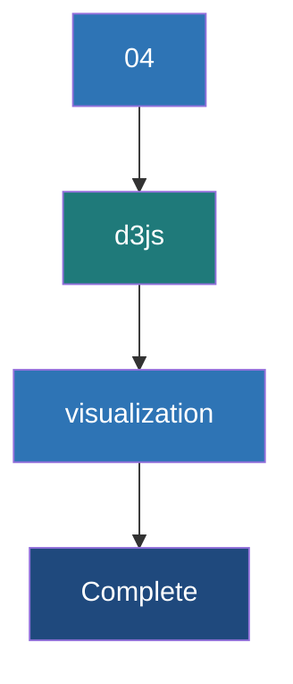

# D3.js Data Visualization

**A powerful JavaScript library for creating dynamic, data-driven visualizations in the browser using SVG, HTML, and CSS.**

## Why It Matters

Collecting real-time data with Spark and delivering it instantly via WebSockets is useless if the end-user cannot easily interpret it. While simple tables might work for debugging, humans process visual patterns much faster than raw numbers. D3.js (Data-Driven Documents) is the industry standard for creating bespoke, interactive data visualizations on the web. Unlike high-level charting libraries (like Chart.js or Highcharts) which offer pre-built but rigid templates, D3 provides low-level control over exactly how data binds to Document Object Model (DOM) elements. This matters deeply for real-time dashboards because D3's "enter, update, exit" pattern and built-in transition engines allow charts to smoothly animate and evolve as new data streams in from Spark, preventing the jarring, flashing screen refreshes typical of older web applications.

## How It Works

D3.js works on a declarative paradigm based on selections and data binding. The workflow for building a real-time chart involves setup, data ingestion, and the update cycle.

**1. Setup (Scales and Axes):** Before any data arrives, you define the canvas. Using D3, you select an HTML container and append an SVG (Scalable Vector Graphics) element. You then define **Scales**. Scales are mathematical functions that map your data dimensions (e.g., a URL count ranging from 0 to 10,000) to visual dimensions (e.g., pixel height on the screen ranging from 0 to 500px). Finally, you define the X and Y axes based on these scales and render them to the screen.

**2. The Data Join (Enter, Update, Exit):** This is the core engine of D3. When the browser receives a JSON payload via WebSockets, that data array is bound to a selection of DOM elements (like SVG `<rect>` elements for a bar chart). D3 calculates the difference between the new data and the existing DOM elements:
* **Enter:** Data points that have no corresponding DOM element yet. D3 creates new elements for these.
* **Update:** Data points that already have a corresponding DOM element. Their properties (like height or width) need to be updated.
* **Exit:** DOM elements that exist on screen, but have no corresponding data in the new payload. D3 removes these.

**3. Transitions:** When the Spark streaming batch completes every 5 seconds, the new JSON payload represents a sudden jump in numbers. To prevent the chart from snapping instantly to the new values—which is hard for the human eye to track—D3 uses **Transitions**. By chaining `.transition().duration(500)` to the update selection, D3 interpolates the values, animating the bars growing or shrinking smoothly over 500 milliseconds. This gives the dashboard a fluid, living feel.

## Flow Diagram



## Data Visualization

How D3 translates Spark JSON output into SVG properties using scales.

| Spark JSON Data | D3 Scale Mapping | Resulting SVG Element Attribute |
|---|---|---|
| `{"url": "/home", "count": 100}` | `xScale("/home") -> 50px`<br>`yScale(100) -> 200px height` | `<rect x="50" y="300" width="40" height="200"></rect>` |
| **Next Batch (5s later)** | | |
| `{"url": "/home", "count": 150}` | `xScale("/home") -> 50px`<br>`yScale(150) -> 300px height` | `<rect x="50" y="200" width="40" height="300"></rect>` |
| **Animation Result** | D3 interpolates height 200 -> 300 | Bar smoothly grows upward on screen |

## Code Example

Below is the JavaScript/D3 code to render and update a real-time bar chart showing Top URLs.

```html
<!DOCTYPE html>
<meta charset="utf-8">
<style>
  .bar { fill: steelblue; }
  .bar:hover { fill: orange; }
  .axis-text { font: 10px sans-serif; }
</style>
<body>
<svg width="600" height="400"></svg>
<script src="https://d3js.org/d3.v7.min.js"></script>
<script>
  // 1. Setup SVG and Margins
  const svg = d3.select("svg"),
        margin = {top: 20, right: 20, bottom: 90, left: 50},
        width = +svg.attr("width") - margin.left - margin.right,
        height = +svg.attr("height") - margin.top - margin.bottom;

  const g = svg.append("g").attr("transform", `translate(${margin.left},${margin.top})`);

  // 2. Setup Scales
  const x = d3.scaleBand().rangeRound([0, width]).padding(0.1);
  const y = d3.scaleLinear().rangeRound([height, 0]);

  // Setup Axes groups
  const xAxis = g.append("g").attr("transform", `translate(0,${height})`);
  const yAxis = g.append("g");

  // 3. The Update Function (Called every time WebSocket receives data)
  function updateChart(data) {
    // Update Scale Domains based on new data
    x.domain(data.map(d => d.url));
    y.domain([0, d3.max(data, d => d.count)]);

    // Call Axes to redraw with new domains
    xAxis.transition().duration(500).call(d3.axisBottom(x))
         .selectAll("text")
         .attr("transform", "rotate(-45)")
         .style("text-anchor", "end");
    yAxis.transition().duration(500).call(d3.axisLeft(y));

    // Data Binding
    const bars = g.selectAll(".bar").data(data, d => d.url);

    // EXIT phase (remove old bars)
    bars.exit()
      .transition().duration(500)
      .attr("y", height)
      .attr("height", 0)
      .remove();

    // ENTER + UPDATE phase
    bars.enter().append("rect")
      .attr("class", "bar")
      .attr("x", d => x(d.url))
      .attr("width", x.bandwidth())
      .attr("y", height) // start at bottom
      .attr("height", 0) // start with 0 height
      .merge(bars) // Merge enter and update selections
      .transition().duration(500) // Animate to new values
      .attr("x", d => x(d.url))
      .attr("width", x.bandwidth())
      .attr("y", d => y(d.count))
      .attr("height", d => height - y(d.count));
  }

  // 4. WebSocket Connection
  const socket = new WebSocket('ws://localhost:8080');
  socket.onmessage = function(event) {
    const payload = JSON.parse(event.data);
    if(payload.top_urls) {
      updateChart(payload.top_urls);
    }
  };
</script>
</body>
```

## Common Pitfalls

* **Forgetting Key Functions in Data Joins:** In `g.selectAll(".bar").data(data, d => d.url)`, the second argument `d => d.url` is the key function. If omitted, D3 binds data by array index. If the ranking of URLs changes between Spark batches, bars will change colors and jump around wildly instead of transitioning smoothly.
* **Over-Transitioning:** Setting transition durations longer than the Spark batch interval (e.g., 6-second transition for a 5-second batch). The next update will interrupt the ongoing animation, causing the chart to stutter or glitch.
* **String vs. Number Bugs:** JSON sent from Kafka might have numbers formatted as strings `{"count": "150"}`. D3 mathematical scales (like `d3.max`) will fail or behave unpredictably (concatenating instead of adding) if strings are not cast to numbers using the `+` operator.
* **SVG coordinate system confusion:** In SVG, the Y-axis starts at `0` at the *top* of the screen and increases downwards. Developers often draw bars upside down hanging from the ceiling before realizing they need to calculate height as `height - y(d.count)` to root them to the floor.
* **DOM Bloat:** Continually appending new elements without handling the `exit().remove()` selection will cause the browser memory to explode as thousands of invisible SVG elements stack up on top of each other.

## Key Takeaway

D3.js brings Spark streaming data to life by utilizing the "enter, update, exit" pattern to intelligently bind JSON metrics to SVG elements, enabling smooth, animated transitions that make real-time dashboards understandable at a glance.
