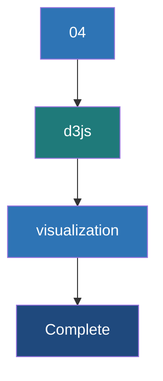

# D3.js Data Visualization

**A powerful JavaScript library for creating dynamic, data-driven visualizations in the browser using SVG, HTML, and CSS.**

## Why It Matters

Collecting real-time data with Spark and delivering it instantly via WebSockets is useless if the end-user cannot easily interpret it. While simple tables might work for debugging, humans process visual patterns much faster than raw numbers. D3.js (Data-Driven Documents) is the industry standard for creating bespoke, interactive data visualizations on the web. Unlike high-level charting libraries (like Chart.js or Highcharts) which offer pre-built but rigid templates, D3 provides low-level control over exactly how data binds to Document Object Model (DOM) elements. This matters deeply for real-time dashboards because D3's "enter, update, exit" pattern and built-in transition engines allow charts to smoothly animate and evolve as new data streams in from Spark, preventing the jarring, flashing screen refreshes typical of older web applications.

## How It Works

D3.js works on a declarative paradigm based on selections and data binding. The workflow for building a real-time chart involves setup, data ingestion, and the update cycle.

**1. Setup (Scales and Axes):** Before any data arrives, you define the canvas. Using D3, you select an HTML container and append an SVG (Scalable Vector Graphics) element. You then define **Scales**. Scales are mathematical functions that map your data dimensions (e.g., a URL count ranging from 0 to 10,000) to visual dimensions (e.g., pixel height on the screen ranging from 0 to 500px). Finally, you define the X and Y axes based on these scales and render them to the screen.

**2. The Data Join (Enter, Update, Exit):** This is the core engine of D3. When the browser receives a JSON payload via WebSockets, that data array is bound to a selection of DOM elements (like SVG `<rect>` elements for a bar chart). D3 calculates the difference between the new data and the existing DOM elements:
* **Enter:** Data points that have no corresponding DOM element yet. D3 creates new elements for these.
* **Update:** Data points that already have a corresponding DOM element. Their properties (like height or width) need to be updated.
* **Exit:** DOM elements that exist on screen, but have no corresponding data in the new payload. D3 removes these.

**3. Transitions:** When the Spark streaming batch completes every 5 seconds, the new JSON payload represents a sudden jump in numbers. To prevent the chart from snapping instantly to the new values—which is hard for the human eye to track—D3 uses **Transitions**. By chaining `.transition().duration(500)` to the update selection, D3 interpolates the values, animating the bars growing or shrinking smoothly over 500 milliseconds. This gives the dashboard a fluid, living feel.

## Flow Diagram



## Data Visualization

How D3 translates Spark JSON output into SVG properties using scales.

| Spark JSON Data | D3 Scale Mapping | Resulting SVG Element Attribute |
|---|---|---|
| `{"url": "/home", "count": 100}` | `xScale("/home") -> 50px`<br>`yScale(100) -> 200px height` | `<rect x="50" y="300" width="40" height="200"></rect>` |
| **Next Batch (5s later)** | | |
| `{"url": "/home", "count": 150}` | `xScale("/home") -> 50px`<br>`yScale(150) -> 300px height` | `<rect x="50" y="200" width="40" height="300"></rect>` |
| **Animation Result** | D3 interpolates height 200 -> 300 | Bar smoothly grows upward on screen |

## Code Example

Below is the JavaScript/D3 code to render and update a real-time bar chart showing Top URLs.

```html
<!DOCTYPE html>
<meta charset="utf-8">
<style>
  .bar { fill: steelblue; }
  .bar:hover { fill: orange; }
  .axis-text { font: 10px sans-serif; }
</style>
<body>
<svg width="600" height="400"></svg>
<script src="https://d3js.org/d3.v7.min.js"></script>
<script>
  // 1. Setup SVG and Margins
  const svg = d3.select("svg"),
        margin = {top: 20, right: 20, bottom: 90, left: 50},
        width = +svg.attr("width") - margin.left - margin.right,
        height = +svg.attr("height") - margin.top - margin.bottom;

  const g = svg.append("g").attr("transform", `translate(${margin.left},${margin.top})`);

  // 2. Setup Scales
  const x = d3.scaleBand().rangeRound([0, width]).padding(0.1);
  const y = d3.scaleLinear().rangeRound([height, 0]);

  // Setup Axes groups
  const xAxis = g.append("g").attr("transform", `translate(0,${height})`);
  const yAxis = g.append("g");

  // 3. The Update Function (Called every time WebSocket receives data)
  function updateChart(data) {
    // Update Scale Domains based on new data
    x.domain(data.map(d => d.url));
    y.domain([0, d3.max(data, d => d.count)]);

    // Call Axes to redraw with new domains
    xAxis.transition().duration(500).call(d3.axisBottom(x))
         .selectAll("text")
         .attr("transform", "rotate(-45)")
         .style("text-anchor", "end");
    yAxis.transition().duration(500).call(d3.axisLeft(y));

    // Data Binding
    const bars = g.selectAll(".bar").data(data, d => d.url);

    // EXIT phase (remove old bars)
    bars.exit()
      .transition().duration(500)
      .attr("y", height)
      .attr("height", 0)
      .remove();

    // ENTER + UPDATE phase
    bars.enter().append("rect")
      .attr("class", "bar")
      .attr("x", d => x(d.url))
      .attr("width", x.bandwidth())
      .attr("y", height) // start at bottom
      .attr("height", 0) // start with 0 height
      .merge(bars) // Merge enter and update selections
      .transition().duration(500) // Animate to new values
      .attr("x", d => x(d.url))
      .attr("width", x.bandwidth())
      .attr("y", d => y(d.count))
      .attr("height", d => height - y(d.count));
  }

  // 4. WebSocket Connection
  const socket = new WebSocket('ws://localhost:8080');
  socket.onmessage = function(event) {
    const payload = JSON.parse(event.data);
    if(payload.top_urls) {
      updateChart(payload.top_urls);
    }
  };
</script>
</body>
```

## Common Pitfalls

* **Forgetting Key Functions in Data Joins:** In `g.selectAll(".bar").data(data, d => d.url)`, the second argument `d => d.url` is the key function. If omitted, D3 binds data by array index. If the ranking of URLs changes between Spark batches, bars will change colors and jump around wildly instead of transitioning smoothly.
* **Over-Transitioning:** Setting transition durations longer than the Spark batch interval (e.g., 6-second transition for a 5-second batch). The next update will interrupt the ongoing animation, causing the chart to stutter or glitch.
* **String vs. Number Bugs:** JSON sent from Kafka might have numbers formatted as strings `{"count": "150"}`. D3 mathematical scales (like `d3.max`) will fail or behave unpredictably (concatenating instead of adding) if strings are not cast to numbers using the `+` operator.
* **SVG coordinate system confusion:** In SVG, the Y-axis starts at `0` at the *top* of the screen and increases downwards. Developers often draw bars upside down hanging from the ceiling before realizing they need to calculate height as `height - y(d.count)` to root them to the floor.
* **DOM Bloat:** Continually appending new elements without handling the `exit().remove()` selection will cause the browser memory to explode as thousands of invisible SVG elements stack up on top of each other.

## Key Takeaway

D3.js brings Spark streaming data to life by utilizing the "enter, update, exit" pattern to intelligently bind JSON metrics to SVG elements, enabling smooth, animated transitions that make real-time dashboards understandable at a glance.


---

## 🎓 Deep Learning Questions

### Q1: Why Was This Concept Introduced?
Before D3.js, web developers struggled to create customized, highly interactive charts for real-time data. Existing libraries provided standard out-of-the-box charts (like pie or bar charts) but lacked flexibility, making it difficult to bind dynamic data streams (such as live sales or server metrics) directly to the Document Object Model (DOM). D3.js (Data-Driven Documents) was introduced to bridge this gap. By utilizing standard web technologies like HTML, SVG, and CSS, D3 allows developers to bind arbitrary data to a DOM and apply data-driven transformations to the document. In the context of a real-time dashboard powered by Spark Streaming, D3.js is crucial because it can efficiently update visualizations as new WebSocket messages arrive without reloading the page, offering smooth transitions and animations.

### Q2: What Exactly Is This Concept and How Does It Work?
D3.js is a JavaScript library that manipulates the DOM based on data. At its core, it works through a data binding mechanism where arrays of data are joined with DOM elements (typically SVGs). When data changes (such as streaming data arriving from Spark), D3’s enter, update, and exit selections manage the elements:
- **Enter:** Creates new DOM elements for new data points.
- **Update:** Modifies existing elements when underlying data values change.
- **Exit:** Removes DOM elements when the corresponding data points no longer exist.
This architecture makes it exceptionally powerful for real-time dashboards. For instance, when streaming event counts arrive from a Spark structured streaming pipeline via a WebSocket, D3.js listens to the messages, updates the data array, and applies smooth transitions to visually reflect the state changes instantly.

### Q3: Where Should This Concept Be Used?
D3.js is universally applied in industries that demand bespoke, highly interactive real-time visual analytics.
- **Financial Services:** Real-time stock tickers, fraud detection dashboards, and cryptocurrency price line charts.
- **E-commerce & Retail (Amazon, Walmart):** Live monitors tracking active cart checkouts, inventory drops, or flash sale performance.
- **Logistics (Uber, DoorDash):** Real-time geographic mapping of drivers, delivery ETAs, and surge pricing zones using geo-spatial SVGs.
- **IT Infrastructure:** Live tracking of server health, network traffic, and CPU utilization across distributed Spark clusters.

### Q4: Where Should This Concept NOT Be Used?
D3.js should not be used for basic, static charts where standard visualization libraries (like Chart.js, Highcharts, or Recharts) suffice. D3 has a steep learning curve and requires managing the DOM directly, making it overkill for simple reporting tasks. Furthermore, since D3 renders elements using SVG or HTML in the DOM, it struggles with rendering massive datasets (e.g., hundreds of thousands of points simultaneously) due to memory constraints and DOM manipulation limits. In such scenarios, Canvas-based or WebGL-based libraries (like Three.js or Deck.gl) are far better choices for performance.

### Q5: How Is This Concept Different from Hadoop?
While Hadoop is a backend processing framework, D3.js is a frontend visualization tool. They exist on completely different ends of a data pipeline.

| Aspect | Hadoop MapReduce | D3.js Visualization |
|---|---|---|
| **Architecture** | Backend distributed cluster | Frontend client-side browser |
| **Performance** | High latency (batch processing) | Low latency (real-time DOM updates) |
| **Processing Model** | Disk-based batch processing | In-memory data binding and rendering |
| **Memory Usage** | Heavy server-side memory | Browser memory limited by DOM size |
| **Fault Tolerance** | High (replication and retries) | None (depends on the web application) |
| **Scalability** | Petabytes of data | Thousands of DOM elements max |
| **Ease of Development** | Complex Java/Python jobs | Complex JavaScript/SVG manipulation |
| **Typical Use Cases** | ETL, Data Warehousing | Interactive dashboards, live charts |
| **Advantages** | Massive scale processing | Pixel-perfect customized visualization |
| **Disadvantages** | Very slow for interactive queries | Steep learning curve, DOM bottleneck |

### Q6: How Can This Concept Be Related to a Traditional RDBMS?
Think of D3.js as the presentation layer that displays the results of your continuous RDBMS queries. 

| RDBMS Concept | D3.js Equivalent | Explanation |
|---|---|---|
| Table Rows | Array of Objects | D3 consumes data as a JSON array where each object is like a row. |
| INSERT | .enter() | When new data points arrive, D3 creates new SVG elements. |
| UPDATE | .merge() / Update | Existing SVG elements adjust their attributes (e.g., height) based on new values. |
| DELETE | .exit().remove() | Data points no longer present in the dataset cause D3 to remove the corresponding elements. |
| Indexes | Key functions | D3 uses keys .data(data, d => d.id) to map objects to elements efficiently, much like a primary key. |

### Q7: What Happens Behind the Scenes?
When a Spark Streaming pipeline sends a real-time update via WebSocket, the D3 pipeline operates as follows:

`	ext
Spark Streaming -> WebSocket Server -> Browser (Client) -> D3 Data Binding -> DOM Update

[Spark Kafka Stream] 
        |
        v
[WebSocket Message (JSON)] 
        |
        v
[JavaScript parses JSON and updates local array]
        |
        v
[D3 .data() Binding] -> Joins new array with SVG elements
        |
   +----+----+----+
   |         |    |
[Enter]  [Update] [Exit]
(Add)    (Resize) (Remove)
   |         |    |
   +----+----+----+
        |
[Transition & Animation] -> Smoothly interpolates layout changes
        |
[Browser Renders SVG]
`
The browser reflows and repaints the DOM dynamically based on D3's calculated attributes (x, y, width, height, colors).

### Q8: Performance Considerations, Best Practices, and Common Mistakes

| Category | Recommendation | Why It Matters |
|---|---|---|
| **Data Binding** | Always use a key function in .data(). | Ensures object constancy during transitions so elements update smoothly rather than re-rendering entirely. |
| **Element Size** | Limit DOM elements to <10,000. | Browsers struggle to render excessive SVG nodes, leading to laggy animations and high CPU use. |
| **Animations** | Use 
equestAnimationFrame or D3's native transitions. | Avoids blocking the main JavaScript thread, ensuring smooth 60fps animations. |
| **WebSocket** | Batch WebSocket messages on the server. | Sending thousands of individual messages per second will overwhelm the browser and D3 renderer. |
| **Common Mistake** | Forgetting to call .exit().remove(). | Results in memory leaks and visually overlapping ghost elements on the chart. |

### Q9: Interview Questions

**Beginner:**
1. What does D3 stand for? *(Data-Driven Documents)*
2. How does D3 integrate with HTML/SVG? *(It binds data to DOM elements and manipulates their attributes using functions based on that data.)*
3. What is the difference between SVG and Canvas? *(SVG creates DOM elements for each shape, making it interactive; Canvas draws pixels on a bitmap, making it faster for large datasets but less interactive.)*

**Intermediate:**
1. Explain the Enter, Update, and Exit pattern. *(Enter creates new elements for new data, Update modifies existing elements for changed data, Exit removes elements for deleted data.)*
2. Why is a key function important when binding data in D3? *(It tracks which datum is bound to which element, enabling smooth transitions and preventing unnecessary element destruction/creation.)*
3. How do you handle real-time streaming data in D3? *(Listen to a WebSocket, push the new data to a JavaScript array, and re-trigger the D3 rendering function using the Enter/Update/Exit flow.)*

**Advanced:**
1. How would you optimize a D3 chart that receives 5000 updates per second from Spark? *(Batch updates on the server or throttle/debounce the rendering on the client; consider switching from SVG to Canvas if necessary.)*
2. Describe how D3 scales (d3-scale) work. *(They map abstract dimensions of data (domain) to visual representation dimensions (range), such as pixel width or color gradients.)*
3. How do transitions work under the hood in D3? *(D3 uses interpolators to calculate intermediate states between an old attribute value and a new attribute value over a set duration.)*

**Scenario-Based:**
1. Your real-time D3 bar chart is slowing down the browser after running for an hour. What is the issue? *(Likely a memory leak caused by not correctly removing old elements using .exit().remove(), resulting in an ever-growing DOM.)*
2. You need to show real-time Uber driver locations on a map. Would you use D3? *(Yes, D3’s geo-projections combined with SVG are excellent for plotting customized map overlays, assuming driver points are aggregated or kept within DOM limits.)*

### Q10: Complete Real-World Example

**Business Problem:**
A ride-hailing company (like Uber) wants to visualize the number of active ride requests per city in real-time on a web dashboard. Spark Structured Streaming is processing the incoming Kafka topics and emitting aggregates via WebSocket.

**Sample Dataset (Received via WebSocket):**
`json
[
  {"city": "New York", "requests": 142},
  {"city": "San Francisco", "requests": 89},
  {"city": "London", "requests": 210}
]
`

**Full Working PySpark / JS Code:**
*(Assuming the Spark job is already outputting to a WebSocket server, here is the frontend HTML/JS utilizing D3.js)*

`html
<!DOCTYPE html>
<html>
<head>
    <script src="https://d3js.org/d3.v7.min.js"></script>
    <style>
        .bar { fill: steelblue; }
        .bar:hover { fill: orange; }
        .axis-label { font-family: sans-serif; font-size: 12px; }
    </style>
</head>
<body>
    <h2>Real-Time Ride Requests by City</h2>
    <svg width="600" height="400"></svg>

    <script>
        const svg = d3.select("svg");
        const margin = {top: 20, right: 20, bottom: 30, left: 100};
        const width = +svg.attr("width") - margin.left - margin.right;
        const height = +svg.attr("height") - margin.top - margin.bottom;

        const g = svg.append("g").attr("transform", `translate(${margin.left},)`);

        // Set up scales
        const x = d3.scaleLinear().rangeRound([0, width]);
        const y = d3.scaleBand().rangeRound([0, height]).padding(0.1);

        // Add axes groups
        const xAxisGroup = g.append("g").attr("transform", `translate(0,)`);
        const yAxisGroup = g.append("g");

        // WebSocket connection
        const socket = new WebSocket('ws://localhost:8080/stream');

        socket.onmessage = function(event) {
            const data = JSON.parse(event.data);
            updateChart(data);
        };

        function updateChart(data) {
            // Update domains based on dynamic data
            x.domain([0, d3.max(data, d => d.requests)]);
            y.domain(data.map(d => d.city));

            // Update axes
            xAxisGroup.transition().duration(500).call(d3.axisBottom(x));
            yAxisGroup.transition().duration(500).call(d3.axisLeft(y));

            // Data binding (using city as the key)
            const bars = g.selectAll(".bar")
                .data(data, d => d.city);

            // EXIT - Remove old bars
            bars.exit()
                .transition().duration(500)
                .attr("width", 0)
                .remove();

            // UPDATE - Update existing bars
            bars.transition().duration(500)
                .attr("width", d => x(d.requests))
                .attr("y", d => y(d.city))
                .attr("height", y.bandwidth());

            // ENTER - Add new bars
            bars.enter().append("rect")
                .attr("class", "bar")
                .attr("y", d => y(d.city))
                .attr("height", y.bandwidth())
                .attr("x", 0)
                .attr("width", 0)
                .transition().duration(500)
                .attr("width", d => x(d.requests));
        }
    </script>
</body>
</html>
`

**Step-by-step execution walkthrough:**
1. The SVG canvas and axes layout are initialized.
2. A WebSocket connection is established to listen for Spark streaming outputs.
3. Every time a message arrives, updateChart is called.
4. Scales (x and y) adjust to the new maximum request counts.
5. D3 binds the data. Missing cities vanish (.exit()), existing cities animate to their new values (.update()), and new cities grow from zero (.enter()).

**Expected Output:**
A horizontal bar chart displaying cities on the Y-axis and request counts on the X-axis. As new data flows in, the bars smoothly resize and reorder automatically.

**Performance Notes:**
Transitions are set to 500ms. If the WebSocket updates faster than 2 times a second, transitions may overlap and glitch. In high-frequency streaming, limit server emission rates or debounce frontend updates.

### 💡 Key Takeaways
- D3.js drives the DOM dynamically based on data, making it ideal for live dashboards.
- The Enter, Update, and Exit pattern is fundamental for rendering real-time streams efficiently.
- Using key functions in data binding ensures visual consistency during transitions.
- D3 scales translate abstract data domains into screen space coordinates.
- Excessive DOM elements in SVG will degrade performance; large datasets require Canvas.

### ⚠️ Common Misconceptions
- **"D3 gives you pre-built charts."** False. D3 provides the mathematical and DOM manipulation primitives; you must construct the charts manually using SVG elements like rect, circle, and path.
- **"D3 replaces HTML/CSS."** False. D3 simply manipulates existing HTML, SVG, and CSS attributes via JavaScript.
- **"D3 handles large scale data better than other libraries."** False. Since D3 manipulates the DOM heavily, it struggles past a few thousand elements compared to WebGL/Canvas solutions.

### 🔗 Related Spark Concepts
- Spark Structured Streaming
- Kafka Integration
- Streaming Aggregations
- Real-Time Sinks and Outputs

### 📚 References for Further Reading
- D3.js Official Documentation
- Learning Spark (O'Reilly)
- Spark: The Definitive Guide (O'Reilly)