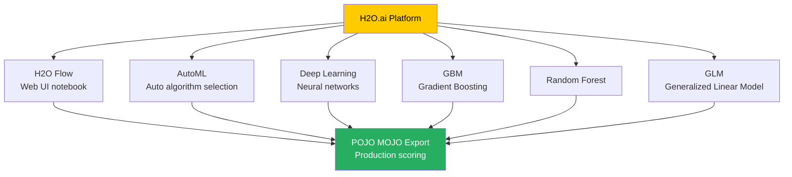

# The H2O Framework

**H2O is an open-source, in-memory, distributed machine learning platform designed to scale to massive datasets while providing an intuitive interface for data scientists and engineers.**

## Why It Matters

As datasets grow exponentially, traditional single-node machine learning libraries (like Python's scikit-learn or R's base packages) struggle to handle the load due to memory constraints and lack of distributed compute capabilities. Data scientists are forced to downsample data or spend days training models. H2O solves this problem by providing a truly distributed, in-memory machine learning engine that can run on clusters of varying sizes—from a single laptop to hundreds of nodes in a Hadoop or Spark cluster.

Understanding the core H2O framework matters because it serves as the engine powering Sparkling Water. H2O provides state-of-the-art implementations of popular algorithms—including Deep Learning, Gradient Boosting Machines (GBM), Random Forests, and Generalized Linear Models (GLM)—that are heavily optimized for distributed computing. Furthermore, H2O democratizes machine learning through features like AutoML (Automated Machine Learning) and intuitive web-based UIs like H2O Flow, bridging the gap between hardcore software engineering and rapid data science experimentation. Its ability to effortlessly export models as POJOs (Plain Old Java Objects) or MOJOs (Model Object, Optimized) makes deploying models into low-latency production environments trivially easy compared to other frameworks.

## How It Works

H2O operates on a distributed architecture based on a cluster of nodes. When you start H2O, you form a cluster, and all nodes in the cluster participate in the computation. The core data structure in H2O is the `H2OFrame`. Unlike traditional data frames that reside in a single machine's memory, an `H2OFrame` is distributed and partitioned across all the nodes in the H2O cluster. The data is stored in a highly compressed, columnar format in-memory, enabling extremely fast reads and aggregations.

When an algorithm is executed, H2O utilizes a paradigm heavily inspired by MapReduce, but optimized for in-memory iterative processing. The computation is pushed to the data. Each node computes partial results on its local partition of the data, and these partial results are then rapidly reduced (aggregated) across the cluster using highly optimized network communication protocols. This allows complex algorithms like Deep Learning or GBM, which require many iterations over the data, to execute with massive parallelism and speed.

One of H2O's standout features is its algorithm breadth and depth. It goes beyond simple implementations; for instance, its Deep Learning algorithm includes adaptive learning rates, dropout for regularization, and L1/L2 penalties. Its AutoML capability can automatically run through a vast hyperparameter search space, training various algorithms and ensembles (stacked models), and then sorting them on a leaderboard.

To interact with H2O, users have multiple options. They can use the Python or R APIs, which act as thin clients that send REST API requests to the H2O cluster. Alternatively, users can utilize H2O Flow, a web-based, interactive, notebook-style interface. H2O Flow allows users to point-and-click their way through data ingestion, summary statistics visualization, model training, and performance evaluation without writing a single line of code, making it an incredible tool for rapid prototyping and exploratory data analysis.

Finally, for production deployment, H2O excels with its model export formats. Instead of requiring a heavy runtime environment to serve predictions, H2O models can be exported as MOJOs or POJOs. These are standalone, highly optimized Java classes or packages that encapsulate the entire trained model structure. They can be embedded directly into streaming applications (like Kafka Streams or Flink), REST APIs, or any Java/Scala application, providing microsecond-level scoring latency.

## Flow Diagram



## Data Visualization

The following table compares H2O's capabilities against standard Apache Spark MLlib, highlighting why many organizations choose to integrate H2O.

| Feature / Capability | Spark MLlib | H2O Framework | H2O Advantage |
|----------------------|-------------|---------------|---------------|
| **Deep Learning** | Limited (Multi-layer Perceptron only) | Advanced (Adaptive learning, Dropout, deep architectures) | Vastly superior deep learning suite |
| **AutoML** | Third-party or custom scripts | Native, robust AutoML with leaderboards and stacked ensembles | Rapid time-to-value for modeling |
| **Gradient Boosting** | GBTClassifier / GBTRegressor | H2O GBM (Highly optimized, GPU support via XGBoost integration) | Faster training, better performance |
| **Model Export** | Spark ML Pipelines (requires Spark runtime) | POJO / MOJO (Standalone Java artifacts) | Microsecond latency, no Spark needed in prod |
| **User Interface** | None (Code only) | H2O Flow (Interactive Web UI) | Easier exploration and visualization |
| **Data Handling** | Distributed RDD/DataFrame | Distributed H2OFrame (Compressed Columnar) | Different memory optimization strategies |

## Code Example

```python
# A standalone Python script demonstrating how to use the H2O framework
# (Note: This is pure H2O, not Sparkling Water, to illustrate the core framework)

import h2o
from h2o.estimators.deeplearning import H2ODeepLearningEstimator
from h2o.automl import H2OAutoML

# 1. Start or connect to a local H2O cluster
# This will launch the JVM and start the distributed in-memory cluster
h2o.init(nthreads=-1, max_mem_size="4G")

print("H2O cluster is up and running!")

# 2. Import data directly into an H2OFrame
# H2O's import function handles distributed reading automatically
url = "http://h2o-public-test-data.s3.amazonaws.com/smalldata/iris/iris_wheader.csv"
iris_df = h2o.import_file(url)

# Display summary statistics of the distributed frame
iris_df.describe()

# 3. Prepare data for modeling
# Predict the 'class' column based on sepal and petal measurements
x = iris_df.columns[:-1] # Features: sepal_len, sepal_wid, petal_len, petal_wid
y = iris_df.columns[-1]  # Target: class

# Ensure target is categorical for classification
iris_df[y] = iris_df[y].asfactor()

# Split data into training and validation sets
train, valid = iris_df.split_frame(ratios=[0.8], seed=1234)

# 4. Train a Deep Learning model using H2O
dl_model = H2ODeepLearningEstimator(
    hidden=[50, 50],          # Two hidden layers with 50 neurons each
    epochs=100,               # Number of passes over the dataset
    activation="Rectifier",   # ReLU activation function
    seed=1234
)

# Execute the distributed training process
dl_model.train(x=x, y=y, training_frame=train, validation_frame=valid)

# Evaluate model performance
print("Deep Learning Model Performance on Validation Set:")
print(dl_model.model_performance(valid=True))

# 5. Alternatively, run H2O AutoML to find the best model
# AutoML will train Random Forests, GBMs, Deep Learning, and Ensembles
aml = H2OAutoML(max_models=5, seed=1234, project_name="iris_classification")
aml.train(x=x, y=y, training_frame=train)

# View the AutoML Leaderboard
print("\nAutoML Leaderboard:")
print(aml.leaderboard)

# 6. Download the best model as a MOJO for production deployment
# The downloaded zip file can be executed in any Java environment
mojo_path = aml.leader.download_mojo(path=".", get_genmodel_jar=True)
print(f"MOJO model exported to: {mojo_path}")

# Shut down the H2O cluster when finished
h2o.cluster().shutdown()
```

## Common Pitfalls

* **Treating H2OFrames like Pandas:** H2OFrames are distributed across the cluster. Attempting to iterate over them row-by-row in a Python `for` loop is extremely slow and defeats the purpose of the framework. Always use built-in vectorized operations.
* **Ignoring H2O Flow:** Many developers strictly stick to the Python/R APIs. H2O Flow is running in the background (usually on `http://localhost:54321`) and provides incredible visual diagnostics, model summaries, and system health metrics that are hard to grasp from code alone.
* **Categorical Feature Limits:** H2O handles categorical variables automatically, but if a categorical feature has tens of thousands of unique levels (cardinality is too high), algorithms like Random Forest will struggle or fail. It's often necessary to group rare levels or use target encoding.
* **Memory Management with Java:** Since H2O runs on the JVM, it is subject to Java garbage collection. If `max_mem_size` is set too low during `h2o.init()`, you may experience severe performance degradation or GC overhead limit exceeded errors.
* **Version Skew:** The Python client version must exactly match the H2O backend cluster version. If they differ, the API will throw serialization and compatibility errors.

## Key Takeaway

H2O transforms complex, large-scale machine learning and deep learning tasks into accessible, highly performant operations, bridging the gap between data science experimentation and low-latency production deployment.
