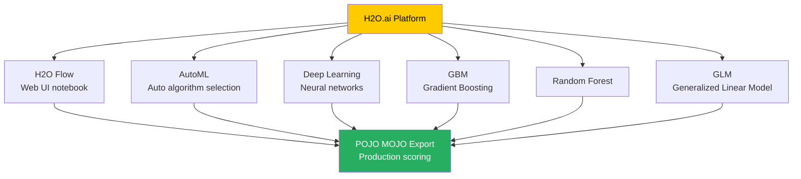

# The H2O Framework

**H2O is an open-source, in-memory, distributed machine learning platform designed to scale to massive datasets while providing an intuitive interface for data scientists and engineers.**

## Why It Matters

As datasets grow exponentially, traditional single-node machine learning libraries (like Python's scikit-learn or R's base packages) struggle to handle the load due to memory constraints and lack of distributed compute capabilities. Data scientists are forced to downsample data or spend days training models. H2O solves this problem by providing a truly distributed, in-memory machine learning engine that can run on clusters of varying sizes—from a single laptop to hundreds of nodes in a Hadoop or Spark cluster.

Understanding the core H2O framework matters because it serves as the engine powering Sparkling Water. H2O provides state-of-the-art implementations of popular algorithms—including Deep Learning, Gradient Boosting Machines (GBM), Random Forests, and Generalized Linear Models (GLM)—that are heavily optimized for distributed computing. Furthermore, H2O democratizes machine learning through features like AutoML (Automated Machine Learning) and intuitive web-based UIs like H2O Flow, bridging the gap between hardcore software engineering and rapid data science experimentation. Its ability to effortlessly export models as POJOs (Plain Old Java Objects) or MOJOs (Model Object, Optimized) makes deploying models into low-latency production environments trivially easy compared to other frameworks.

## How It Works

H2O operates on a distributed architecture based on a cluster of nodes. When you start H2O, you form a cluster, and all nodes in the cluster participate in the computation. The core data structure in H2O is the `H2OFrame`. Unlike traditional data frames that reside in a single machine's memory, an `H2OFrame` is distributed and partitioned across all the nodes in the H2O cluster. The data is stored in a highly compressed, columnar format in-memory, enabling extremely fast reads and aggregations.

When an algorithm is executed, H2O utilizes a paradigm heavily inspired by MapReduce, but optimized for in-memory iterative processing. The computation is pushed to the data. Each node computes partial results on its local partition of the data, and these partial results are then rapidly reduced (aggregated) across the cluster using highly optimized network communication protocols. This allows complex algorithms like Deep Learning or GBM, which require many iterations over the data, to execute with massive parallelism and speed.

One of H2O's standout features is its algorithm breadth and depth. It goes beyond simple implementations; for instance, its Deep Learning algorithm includes adaptive learning rates, dropout for regularization, and L1/L2 penalties. Its AutoML capability can automatically run through a vast hyperparameter search space, training various algorithms and ensembles (stacked models), and then sorting them on a leaderboard.

To interact with H2O, users have multiple options. They can use the Python or R APIs, which act as thin clients that send REST API requests to the H2O cluster. Alternatively, users can utilize H2O Flow, a web-based, interactive, notebook-style interface. H2O Flow allows users to point-and-click their way through data ingestion, summary statistics visualization, model training, and performance evaluation without writing a single line of code, making it an incredible tool for rapid prototyping and exploratory data analysis.

Finally, for production deployment, H2O excels with its model export formats. Instead of requiring a heavy runtime environment to serve predictions, H2O models can be exported as MOJOs or POJOs. These are standalone, highly optimized Java classes or packages that encapsulate the entire trained model structure. They can be embedded directly into streaming applications (like Kafka Streams or Flink), REST APIs, or any Java/Scala application, providing microsecond-level scoring latency.

## Flow Diagram



## Data Visualization

The following table compares H2O's capabilities against standard Apache Spark MLlib, highlighting why many organizations choose to integrate H2O.

| Feature / Capability | Spark MLlib | H2O Framework | H2O Advantage |
|----------------------|-------------|---------------|---------------|
| **Deep Learning** | Limited (Multi-layer Perceptron only) | Advanced (Adaptive learning, Dropout, deep architectures) | Vastly superior deep learning suite |
| **AutoML** | Third-party or custom scripts | Native, robust AutoML with leaderboards and stacked ensembles | Rapid time-to-value for modeling |
| **Gradient Boosting** | GBTClassifier / GBTRegressor | H2O GBM (Highly optimized, GPU support via XGBoost integration) | Faster training, better performance |
| **Model Export** | Spark ML Pipelines (requires Spark runtime) | POJO / MOJO (Standalone Java artifacts) | Microsecond latency, no Spark needed in prod |
| **User Interface** | None (Code only) | H2O Flow (Interactive Web UI) | Easier exploration and visualization |
| **Data Handling** | Distributed RDD/DataFrame | Distributed H2OFrame (Compressed Columnar) | Different memory optimization strategies |

## Code Example

```python
# A standalone Python script demonstrating how to use the H2O framework
# (Note: This is pure H2O, not Sparkling Water, to illustrate the core framework)

import h2o
from h2o.estimators.deeplearning import H2ODeepLearningEstimator
from h2o.automl import H2OAutoML

# 1. Start or connect to a local H2O cluster
# This will launch the JVM and start the distributed in-memory cluster
h2o.init(nthreads=-1, max_mem_size="4G")

print("H2O cluster is up and running!")

# 2. Import data directly into an H2OFrame
# H2O's import function handles distributed reading automatically
url = "http://h2o-public-test-data.s3.amazonaws.com/smalldata/iris/iris_wheader.csv"
iris_df = h2o.import_file(url)

# Display summary statistics of the distributed frame
iris_df.describe()

# 3. Prepare data for modeling
# Predict the 'class' column based on sepal and petal measurements
x = iris_df.columns[:-1] # Features: sepal_len, sepal_wid, petal_len, petal_wid
y = iris_df.columns[-1]  # Target: class

# Ensure target is categorical for classification
iris_df[y] = iris_df[y].asfactor()

# Split data into training and validation sets
train, valid = iris_df.split_frame(ratios=[0.8], seed=1234)

# 4. Train a Deep Learning model using H2O
dl_model = H2ODeepLearningEstimator(
    hidden=[50, 50],          # Two hidden layers with 50 neurons each
    epochs=100,               # Number of passes over the dataset
    activation="Rectifier",   # ReLU activation function
    seed=1234
)

# Execute the distributed training process
dl_model.train(x=x, y=y, training_frame=train, validation_frame=valid)

# Evaluate model performance
print("Deep Learning Model Performance on Validation Set:")
print(dl_model.model_performance(valid=True))

# 5. Alternatively, run H2O AutoML to find the best model
# AutoML will train Random Forests, GBMs, Deep Learning, and Ensembles
aml = H2OAutoML(max_models=5, seed=1234, project_name="iris_classification")
aml.train(x=x, y=y, training_frame=train)

# View the AutoML Leaderboard
print("\nAutoML Leaderboard:")
print(aml.leaderboard)

# 6. Download the best model as a MOJO for production deployment
# The downloaded zip file can be executed in any Java environment
mojo_path = aml.leader.download_mojo(path=".", get_genmodel_jar=True)
print(f"MOJO model exported to: {mojo_path}")

# Shut down the H2O cluster when finished
h2o.cluster().shutdown()
```

## Common Pitfalls

* **Treating H2OFrames like Pandas:** H2OFrames are distributed across the cluster. Attempting to iterate over them row-by-row in a Python `for` loop is extremely slow and defeats the purpose of the framework. Always use built-in vectorized operations.
* **Ignoring H2O Flow:** Many developers strictly stick to the Python/R APIs. H2O Flow is running in the background (usually on `http://localhost:54321`) and provides incredible visual diagnostics, model summaries, and system health metrics that are hard to grasp from code alone.
* **Categorical Feature Limits:** H2O handles categorical variables automatically, but if a categorical feature has tens of thousands of unique levels (cardinality is too high), algorithms like Random Forest will struggle or fail. It's often necessary to group rare levels or use target encoding.
* **Memory Management with Java:** Since H2O runs on the JVM, it is subject to Java garbage collection. If `max_mem_size` is set too low during `h2o.init()`, you may experience severe performance degradation or GC overhead limit exceeded errors.
* **Version Skew:** The Python client version must exactly match the H2O backend cluster version. If they differ, the API will throw serialization and compatibility errors.

## Key Takeaway

H2O transforms complex, large-scale machine learning and deep learning tasks into accessible, highly performant operations, bridging the gap between data science experimentation and low-latency production deployment.


---

## 🎓 Deep Learning Questions

### Q1: Why Was This Concept Introduced?
Before the H2O Framework, data scientists relied on local tools like scikit-learn or R base packages. These tools were heavily limited by single-machine memory constraints. When dealing with big data, developers had to downsample datasets or endure multi-day training times. Spark MLlib brought distributed machine learning, but it had limitations with advanced algorithms, particularly Deep Learning and robust AutoML. H2O was introduced to solve these limitations by providing a first-class, distributed in-memory machine learning engine that seamlessly scales across a cluster while delivering top-tier algorithms like Deep Learning, Gradient Boosting (GBM), and XGBoost. It bridges the gap between big data processing and high-performance ML, offering production-ready deployments via MOJO/POJO formats without needing a heavy runtime.

### Q2: What Exactly Is This Concept and How Does It Work?
The H2O Framework is a fully distributed, in-memory machine learning platform. At its core, it uses a distributed key-value store and a primary data structure called the `H2OFrame`. An H2OFrame acts like a single table of data, but it is partitioned and distributed across the memory of all nodes in a cluster. The data is stored in a highly compressed columnar format, optimizing memory footprint and speeding up aggregations. 

When you trigger a machine learning algorithm, H2O brings the compute to the data. It uses an iterative MapReduce-style paradigm optimized for fast network communication. Each node computes partial gradients or weights based on its local chunk of data. These local results are quickly reduced and synchronized across the cluster. This allows complex, iterative models like Neural Networks or Random Forests to train much faster than they would on a single node. H2O also abstracts the complexity by providing easy-to-use APIs in Python, R, and a visual Web UI called H2O Flow.

### Q3: Where Should This Concept Be Used?
H2O is ideal for enterprise machine learning applications requiring high scalability, rapid experimentation, and low-latency production scoring.
- **Banking & Finance:** Used for credit scoring, fraud detection, and algorithmic trading where models must evaluate massive datasets quickly and score transactions in milliseconds.
- **Healthcare:** Used for patient readmission prediction and medical imaging analysis, benefiting from its deep learning capabilities.
- **Retail & E-commerce:** Highly effective for customer churn prediction, recommendation engines, and inventory forecasting using AutoML.
- **Telecommunications:** Ideal for network optimization and predicting equipment failures using historical sensor data across distributed nodes.

### Q4: Where Should This Concept NOT Be Used?
- **Small Datasets:** If the data easily fits into the memory of a single machine, setting up an H2O cluster introduces unnecessary overhead. Traditional tools like scikit-learn or XGBoost locally are faster and simpler.
- **Unstructured Data Processing:** While H2O supports deep learning, for extremely complex unstructured data (like complex video processing or advanced NLP), dedicated deep learning frameworks like TensorFlow or PyTorch are more appropriate.
- **Simple ETL Tasks:** H2O is designed for machine learning. If you only need to join, filter, and aggregate data, Apache Spark's DataFrame API or native SQL is much more efficient and robust.

### Q5: How Is This Concept Different from Hadoop?

| Aspect | Hadoop MapReduce | Apache Spark + H2O Framework |
|---|---|---|
| **Architecture** | Disk-based, batch processing. | In-memory distributed ML engine. |
| **Performance** | Slow for iterative algorithms due to disk I/O. | Blazing fast due to compressed, columnar in-memory processing. |
| **Processing Model** | Two-stage Map and Reduce paradigm. | Iterative, network-optimized MapReduce specifically for ML. |
| **Memory Usage** | High disk reliance, lower memory need. | Heavy reliance on RAM for speed and caching. |
| **Fault Tolerance** | High, via data replication (HDFS). | Achieved via re-computation or checkpoints, but less resilient than Hadoop. |
| **Scalability** | Massive, petabytes of data. | Scales well but bounded by available cluster memory. |
| **Ease of Development** | Complex Java code required. | Simple APIs in Python/R, plus web-based H2O Flow UI. |
| **Typical Use Cases** | Log parsing, ETL, batch jobs. | Deep Learning, AutoML, predictive analytics. |
| **Advantages** | Extremely resilient and handles infinite data size. | Fast training, automated model selection, POJO/MOJO deployment. |
| **Disadvantages** | Not suitable for machine learning. | Requires significant RAM allocation. |

### Q6: How Can This Concept Be Related to a Traditional RDBMS?

| Aspect | Traditional RDBMS | H2O Framework |
|---|---|---|
| **Primary Goal** | Transactional integrity and structured querying (OLTP). | Distributed machine learning and predictive modeling. |
| **Data Structure** | Tables with rows and strict schemas. | H2OFrame (Distributed columnar structure similar to a DataFrame). |
| **Processing Engine** | SQL query planner and execution engine. | Distributed MapReduce-like engine for ML algorithms. |
| **User Interface** | SQL IDEs (e.g., pgAdmin, SSMS). | H2O Flow (Web-based interactive notebook). |
| **Output / Artifact** | Result sets or materialized views. | Trained models, MOJOs, and POJOs. |

### Q7: What Happens Behind the Scenes?
When a user submits an H2O machine learning task via Python:
1. **Client Request:** The Python client translates the API call into a REST request and sends it to the H2O Cluster Leader.
2. **Distributed Parsing:** If reading data, H2O ingests it in parallel across all nodes, parsing it into a distributed `H2OFrame`.
3. **Data Compression:** The data is compressed using a columnar format and stored directly in the Java heap memory of the nodes.
4. **Algorithm Execution:** The H2O Leader coordinates the algorithm. The task is broken down into parallel computations.
5. **Map Phase:** Each node computes partial ML statistics (like tree histograms or network gradients) on its local data chunk.
6. **Reduce Phase:** Nodes communicate over a high-speed network to aggregate the partial statistics globally.
7. **Iteration:** Steps 5 and 6 repeat until the algorithm converges or reaches the max epochs.
8. **Model Generation:** The final model object is assembled and can be downloaded as a low-latency MOJO for production.

```text
[Python Client] --REST API--> [H2O Cluster Leader]
                                 |
           +---------------------+---------------------+
           |                     |                     |
     [H2O Node 1]          [H2O Node 2]          [H2O Node 3]
     (H2OFrame Chunk)      (H2OFrame Chunk)      (H2OFrame Chunk)
           |                     |                     |
        Compute               Compute               Compute
      Gradients             Gradients             Gradients
           |                     |                     |
           +----------+----------+----------+----------+
                      |
              [Global Aggregation]
                      |
                [Model Updated] ---> (Iterate until convergence) ---> [Export MOJO]
```

### Q8: Performance Considerations, Best Practices, and Common Mistakes

| Category | Recommendation | Why It Matters |
|---|---|---|
| **Memory Allocation** | Give H2O nodes 3-4x the RAM of your dataset size. | H2O is entirely in-memory. If RAM is insufficient, it spills to disk or crashes with OOM errors. |
| **Data Cardinality** | Limit categorical feature levels or use target encoding. | High cardinality (e.g., zip codes, user IDs) dramatically slows down tree-based models and consumes massive memory. |
| **Client/Server Mismatch** | Ensure the Python/R client version exactly matches the H2O cluster version. | Version mismatches cause silent failures, serialization errors, or unexpected REST API issues. |
| **Vectorized Operations** | Avoid iterating over H2OFrames row-by-row. | H2OFrames are distributed; row-level iteration pulls data to the client, ruining performance. |
| **AutoML Constraints** | Set `max_models` or `max_runtime_secs` during AutoML. | Without limits, AutoML can run indefinitely, consuming cluster resources and delaying results. |

### Q9: Interview Questions

**Beginner**
1. **What is the core data structure in H2O?** 
   *Answer:* The `H2OFrame`, which is a distributed, in-memory, columnar data table spanning multiple nodes in a cluster.
2. **What is H2O Flow?** 
   *Answer:* A web-based, interactive notebook interface that allows users to ingest data, visualize it, and train models without writing code.
3. **How is a model deployed in H2O?** 
   *Answer:* Models are typically exported as MOJOs or POJOs—standalone Java classes that offer microsecond scoring latency without needing a heavy runtime.

**Intermediate**
4. **How does H2O handle missing values during model training?** 
   *Answer:* H2O handles missing data natively depending on the algorithm. For tree-based models, it sends missing values down a specific branch that minimizes loss.
5. **What is the difference between H2O and Spark MLlib?** 
   *Answer:* H2O offers a richer set of advanced algorithms (like Deep Learning and robust AutoML) and allows exporting models as lightweight Java artifacts (MOJOs), whereas MLlib models typically require a Spark context to run.
6. **Why is it important to use categorical encoding properly in H2O?** 
   *Answer:* High cardinality categoricals can explode memory usage and training time. Proper encoding prevents out-of-memory errors and improves model accuracy.

**Advanced**
7. **Explain the distributed training process of a Deep Learning model in H2O.** 
   *Answer:* H2O uses Hogwild!, a lock-free approach to parallel stochastic gradient descent. Nodes independently update model weights on local chunks of data, and weights are periodically synchronized across the cluster via model averaging.
8. **What are the memory requirements for an H2O cluster compared to the dataset size?** 
   *Answer:* As a rule of thumb, H2O requires at least 3-4 times the size of the dataset in memory to accommodate the raw data, parsed data, and the overhead of training models (especially ensembles).
9. **How do you tune H2O memory configurations in a production environment?** 
   *Answer:* You must carefully set the Java Heap size (`-Xmx`) avoiding sizes over 32GB to prevent JVM garbage collection pauses, or explicitly tuning the GC settings if larger heaps are strictly necessary.

**Scenario-Based**
10. **You are running H2O AutoML and the cluster frequently crashes with OutOfMemory errors. How do you resolve this?** 
    *Answer:* I would limit the `max_models` or `max_runtime_secs` parameter in AutoML. I would also check if the data can be downsampled, or ensure the H2O cluster nodes have adequate RAM configured via the JVM heap settings.
11. **Your data science team developed an H2O model in Python and the software engineers want to embed it in a low-latency Java application. How do you facilitate this?** 
    *Answer:* I would export the trained model as a MOJO. The engineers can include the lightweight `h2o-genmodel.jar` in their Java application and load the MOJO to score incoming data in microseconds, completely independent of the Python environment or H2O cluster.

### Q10: Complete Real-World Example
**Business Problem:** A telecom company (like AT&T or Verizon) wants to predict customer churn based on historical usage data. They need to test multiple algorithms quickly and deploy the best one to a real-time streaming application.
**Dataset:** A CSV containing customer demographics, monthly charges, tenure, and a binary `Churn` column.

```python
import h2o
from h2o.automl import H2OAutoML

# Initialize the H2O cluster locally
h2o.init(nthreads=-1, max_mem_size="8G")

# Load data into a distributed H2OFrame
data_path = "https://raw.githubusercontent.com/IBM/telco-customer-churn-on-icp4d/master/data/Telco-Customer-Churn.csv"
df = h2o.import_file(data_path)

# Define predictor columns and target column
target = "Churn"
features = [col for col in df.columns if col != target and col != "customerID"]

# Convert the target column to categorical for classification
df[target] = df[target].asfactor()

# Split the dataset: 80% for training, 20% for testing
train, test = df.split_frame(ratios=[0.8], seed=42)

# Run AutoML to automatically train and tune multiple models
# We limit to 10 models to save time
aml = H2OAutoML(max_models=10, seed=42, project_name="telco_churn")
aml.train(x=features, y=target, training_frame=train)

# Display the leaderboard of trained models
print(aml.leaderboard)

# Predict on the test set using the best model (the leader)
predictions = aml.leader.predict(test)
print(predictions.head())

# Export the best model as a MOJO for production deployment
mojo_file = aml.leader.download_mojo(path="./deploy", get_genmodel_jar=True)
print(f"Model deployed as MOJO to: {mojo_file}")

# Shut down the cluster
h2o.cluster().shutdown()
```
**Step-by-step execution walkthrough:**
1. `h2o.init()` starts a JVM-based in-memory cluster.
2. `h2o.import_file()` reads the CSV in parallel across nodes into an `H2OFrame`.
3. The data is preprocessed, ensuring the target column is treated as a categorical variable for binary classification.
4. `H2OAutoML` trains multiple algorithms (Random Forest, GBM, Deep Learning) and their hyperparameter combinations, ranking them by cross-validation metrics.
5. The `leaderboard` displays the best models. The `leader` model is used to generate predictions.
6. The leader model is exported as a MOJO artifact, ready for real-time Java deployment.

**Performance Notes:** H2O's compressed columnar format drastically reduces the memory footprint compared to raw CSV size. However, setting `max_mem_size` accurately is critical to avoid JVM garbage collection bottlenecks during AutoML ensemble generation.
**When this approach is best:** When you need a highly optimized model quickly without manual tuning, and require a deployment artifact (MOJO) that supports extremely low-latency scoring outside of Python.

### 💡 Key Takeaways
- H2O is a distributed, in-memory ML framework offering advanced algorithms like Deep Learning and GBMs.
- `H2OFrame` is the core data structure, storing data in a compressed columnar format across a cluster.
- H2O Flow provides a visual, code-free interface for data exploration and model training.
- AutoML automates algorithm selection and hyperparameter tuning, generating stacked ensembles.
- MOJOs and POJOs allow for seamless, microsecond-latency model deployment in Java/Scala environments without heavy runtimes.

### ⚠️ Common Misconceptions
- **H2O is just another library like scikit-learn:** No, H2O is a fully distributed cluster-based engine, not a single-machine library.
- **You need Spark to run H2O:** While Sparkling Water integrates H2O with Spark, H2O can run entirely independently on its own cluster.
- **H2O Python API executes locally:** The Python/R APIs are just thin clients; all actual computation happens on the distributed H2O Java cluster.

### 🔗 Related Spark Concepts
- Sparkling Water (H2O + Spark integration)
- Spark MLlib (Spark's native ML library)
- Resilient Distributed Datasets (RDDs)
- Spark DataFrames

### 📚 References for Further Reading
- Apache Spark Official Documentation
- Learning Spark (O'Reilly)
- Spark: The Definitive Guide (O'Reilly)
