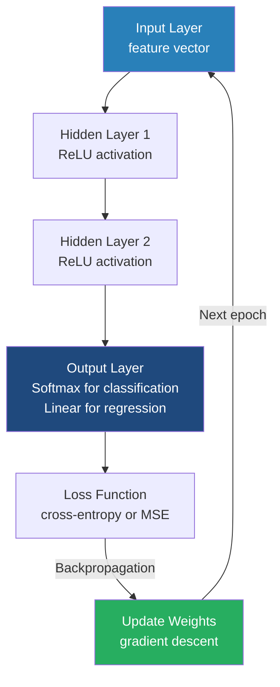

# Deep Learning Concepts

**Deep learning uses multi-layered artificial neural networks to automatically extract hierarchical representations from data, enabling breakthroughs in complex pattern recognition tasks.**

## Why It Matters

Traditional machine learning algorithms (like Linear Regression, Random Forests, or Support Vector Machines) often rely heavily on manual feature engineering. Data scientists must use their domain expertise to extract relevant features from the raw data before feeding it to the algorithm. This approach works well for tabular data but breaks down when dealing with unstructured data such as images, audio, natural language text, or highly complex, non-linear relationships. 

Deep Learning matters because it automates feature extraction. By stacking multiple layers of artificial neurons, a deep neural network learns to represent data at increasing levels of abstraction. For example, in image recognition, the first layer might learn to detect simple edges; the second layer combines edges to detect shapes; and deeper layers combine shapes to recognize a face or a car. This hierarchical learning capability has revolutionized artificial intelligence, allowing models to achieve superhuman performance in computer vision, language translation, and speech recognition. Understanding these foundational concepts is crucial before applying them via frameworks like H2O and Spark, as proper configuration of layers, activation functions, and regularization is required to train these powerful models successfully.

## How It Works

At the fundamental level, a neural network is composed of interconnected nodes, or **neurons**, organized into layers. The architecture typically consists of an **input layer** (which receives the raw data features), one or more **hidden layers** (where the complex processing occurs), and an **output layer** (which produces the final prediction or classification). The connections between neurons have associated **weights**, and each neuron has a **bias**. When a neuron receives inputs, it multiplies them by the corresponding weights, sums them up, adds the bias, and then passes the result through an **activation function**.

The activation function is what introduces non-linearity into the network, allowing it to learn complex, non-linear boundaries. Without activation functions, no matter how many layers a network has, it would essentially collapse into a single linear regression model. Common activation functions include the **Sigmoid** (which squashes values between 0 and 1), **Tanh** (values between -1 and 1), and **ReLU** (Rectified Linear Unit, which returns 0 if the input is negative, and the raw input if positive). ReLU has become the default for hidden layers because it is computationally efficient and helps mitigate the **vanishing gradient problem**—a phenomenon where gradients become incredibly small in deep networks, preventing weights from updating effectively during training.

Training a neural network involves two main passes: **forward propagation** and **backpropagation**. During forward propagation, data flows from the input layer to the output layer to make a prediction. The network then calculates the error (or loss) between its prediction and the actual true label. During backpropagation, the network uses calculus—specifically the **chain rule**—to calculate the gradient of the loss function with respect to every single weight and bias in the network. An optimization algorithm, usually a variant of Gradient Descent, then adjusts the weights slightly in the opposite direction of the gradient to minimize the error.

Because deep learning models have millions or billions of parameters, they are highly prone to **overfitting** (memorizing the training data instead of generalizing). To combat this, regularization techniques are crucial. **Dropout** is a powerful technique where randomly selected neurons are temporarily ignored (or "dropped out") during each training iteration. This forces the network to learn redundant representations and prevents complex co-adaptations between neurons. Another essential technique is **Batch Normalization**, which normalizes the inputs to each layer for every mini-batch, stabilizing the learning process, allowing for higher learning rates, and dramatically speeding up convergence.

## Flow Diagram



## Mathematical Formulas

To truly understand neural networks, one must look at the underlying mathematics.

**1. Neuron Output Calculation:**
For a given neuron, the pre-activation sum $z$ is calculated as the dot product of inputs $x$ and weights $w$, plus the bias $b$:
$$ z = \sum_{i=1}^{n} (w_i \cdot x_i) + b $$

**2. Activation Functions:**
The result $z$ is passed through an activation function $f(z)$ to produce the final output $a = f(z)$.
*   **Sigmoid:** Good for probabilities, but suffers from vanishing gradients.
    $$ f(z) = \frac{1}{1 + e^{-z}} $$
*   **Tanh:** Zero-centered, generally preferred over sigmoid for hidden layers.
    $$ f(z) = \frac{e^z - e^{-z}}{e^z + e^{-z}} $$
*   **ReLU (Rectified Linear Unit):** Fast, non-linear, and solves vanishing gradients.
    $$ f(z) = \max(0, z) $$
*   **Softmax:** Used in the output layer for multi-class classification to output a probability distribution summing to 1.
    $$ \sigma(z)_i = \frac{e^{z_i}}{\sum_{j=1}^{K} e^{z_j}} $$

**3. Backpropagation (Chain Rule):**
To update a specific weight $w_{jk}$, we need to know how changing it affects the total Loss $L$. We use the chain rule of calculus:
$$ \frac{\partial L}{\partial w_{jk}} = \frac{\partial L}{\partial a_j} \cdot \frac{\partial a_j}{\partial z_j} \cdot \frac{\partial z_j}{\partial w_{jk}} $$
Weights are then updated using a learning rate $\eta$:
$$ w_{jk}^{new} = w_{jk}^{old} - \eta \cdot \frac{\partial L}{\partial w_{jk}} $$

## Data Visualization

The following table summarizes when to use specific configurations when designing a deep neural network architecture.

| Problem Type | Output Layer Neurons | Output Activation | Loss Function (Error) | Example Use Case |
|--------------|----------------------|-------------------|-----------------------|------------------|
| **Regression** | 1 | Linear (Identity) | Mean Squared Error (MSE) | Predicting house prices or temperature |
| **Binary Classification** | 1 | Sigmoid | Binary Cross-Entropy (Log Loss)| Spam detection (Yes/No) |
| **Multi-class Classification**| $N$ (number of classes) | Softmax | Categorical Cross-Entropy | Recognizing handwritten digits (0-9) |
| **Multi-label Classification**| $N$ (number of classes) | Sigmoid | Binary Cross-Entropy | Tagging images with multiple objects (Cat AND Dog)|

## Code Example

While frameworks handle the math for you, building a simple multi-layer perceptron architecture conceptually maps to this structure (pseudocode/configuration style):

```python
# Conceptual deep learning architecture configuration
# This mimics how you might design a network mentally before configuring it in H2O

class NeuralNetworkArchitecture:
    def __init__(self):
        # Input data: e.g., an image flattened into 784 pixels (28x28)
        self.input_layer_size = 784
        
        # Deep architecture defining the hidden layers
        self.hidden_layers = [
            {"neurons": 512, "activation": "ReLU", "dropout": 0.2},
            {"neurons": 256, "activation": "ReLU", "dropout": 0.2},
            {"neurons": 128, "activation": "ReLU", "dropout": 0.2}
        ]
        
        # Output layer for multi-class classification (e.g., 10 digits: 0-9)
        self.output_layer = {
            "neurons": 10,
            "activation": "Softmax"
        }
        
        # Optimization settings
        self.optimizer = "Stochastic Gradient Descent (SGD)"
        self.learning_rate = 0.01
        self.loss_function = "Categorical Cross-Entropy"

    def describe(self):
        print(f"Input Features: {self.input_layer_size}")
        print("Network Topology:")
        for idx, layer in enumerate(self.hidden_layers):
            print(f"  Layer {idx+1}: {layer['neurons']} neurons, "
                  f"Activation: {layer['activation']}, "
                  f"Dropout: {layer['dropout']*100}%")
        print(f"Output: {self.output_layer['neurons']} classes, "
              f"Activation: {self.output_layer['activation']}")

# Output the conceptual design
arch = NeuralNetworkArchitecture()
arch.describe()
```

## Common Pitfalls

* **Vanishing/Exploding Gradients:** Using Sigmoid or Tanh in very deep networks causes gradients to shrink to near zero, stopping learning. Alternatively, weights can grow exponentially, causing numerical instability (NaNs). Using ReLU activation and proper weight initialization (like He or Xavier initialization) usually solves this.
* **Overfitting on Small Data:** Deep learning models are data-hungry. If you train a network with millions of parameters on a dataset with only a few thousand rows, it will perfectly memorize the training data but fail on test data. Always use Dropout, L1/L2 regularization, or Early Stopping to prevent this.
* **Not Normalizing Input Data:** Neural networks are extremely sensitive to the scale of input features. If one feature ranges from 0 to 1 and another from 0 to 1,000,000, the network will struggle to converge. Always scale inputs (e.g., Standardization to mean 0, variance 1) before training.
* **Wrong Output Activation:** Using ReLU or Linear activation on an output layer meant for probability classification will yield garbage results. Always match the output activation function to the problem type (Softmax for multi-class, Sigmoid for binary).
* **Setting Learning Rate Too High:** A learning rate that is too high causes the optimization algorithm to overshoot the minimum loss, leading to wild fluctuations in accuracy and failure to converge.

## Key Takeaway

Deep learning leverages stacked layers of non-linear transformations to automatically discover intricate representations in data, deriving its power from backpropagation and careful architectural design involving activation functions and regularization.
