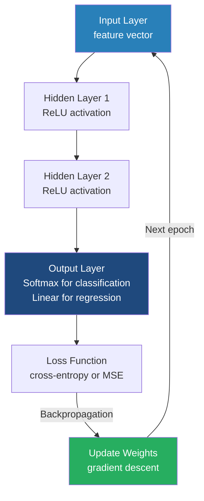

# Deep Learning Concepts

**Deep learning uses multi-layered artificial neural networks to automatically extract hierarchical representations from data, enabling breakthroughs in complex pattern recognition tasks.**

## Why It Matters

Traditional machine learning algorithms (like Linear Regression, Random Forests, or Support Vector Machines) often rely heavily on manual feature engineering. Data scientists must use their domain expertise to extract relevant features from the raw data before feeding it to the algorithm. This approach works well for tabular data but breaks down when dealing with unstructured data such as images, audio, natural language text, or highly complex, non-linear relationships. 

Deep Learning matters because it automates feature extraction. By stacking multiple layers of artificial neurons, a deep neural network learns to represent data at increasing levels of abstraction. For example, in image recognition, the first layer might learn to detect simple edges; the second layer combines edges to detect shapes; and deeper layers combine shapes to recognize a face or a car. This hierarchical learning capability has revolutionized artificial intelligence, allowing models to achieve superhuman performance in computer vision, language translation, and speech recognition. Understanding these foundational concepts is crucial before applying them via frameworks like H2O and Spark, as proper configuration of layers, activation functions, and regularization is required to train these powerful models successfully.

## How It Works

At the fundamental level, a neural network is composed of interconnected nodes, or **neurons**, organized into layers. The architecture typically consists of an **input layer** (which receives the raw data features), one or more **hidden layers** (where the complex processing occurs), and an **output layer** (which produces the final prediction or classification). The connections between neurons have associated **weights**, and each neuron has a **bias**. When a neuron receives inputs, it multiplies them by the corresponding weights, sums them up, adds the bias, and then passes the result through an **activation function**.

The activation function is what introduces non-linearity into the network, allowing it to learn complex, non-linear boundaries. Without activation functions, no matter how many layers a network has, it would essentially collapse into a single linear regression model. Common activation functions include the **Sigmoid** (which squashes values between 0 and 1), **Tanh** (values between -1 and 1), and **ReLU** (Rectified Linear Unit, which returns 0 if the input is negative, and the raw input if positive). ReLU has become the default for hidden layers because it is computationally efficient and helps mitigate the **vanishing gradient problem**—a phenomenon where gradients become incredibly small in deep networks, preventing weights from updating effectively during training.

Training a neural network involves two main passes: **forward propagation** and **backpropagation**. During forward propagation, data flows from the input layer to the output layer to make a prediction. The network then calculates the error (or loss) between its prediction and the actual true label. During backpropagation, the network uses calculus—specifically the **chain rule**—to calculate the gradient of the loss function with respect to every single weight and bias in the network. An optimization algorithm, usually a variant of Gradient Descent, then adjusts the weights slightly in the opposite direction of the gradient to minimize the error.

Because deep learning models have millions or billions of parameters, they are highly prone to **overfitting** (memorizing the training data instead of generalizing). To combat this, regularization techniques are crucial. **Dropout** is a powerful technique where randomly selected neurons are temporarily ignored (or "dropped out") during each training iteration. This forces the network to learn redundant representations and prevents complex co-adaptations between neurons. Another essential technique is **Batch Normalization**, which normalizes the inputs to each layer for every mini-batch, stabilizing the learning process, allowing for higher learning rates, and dramatically speeding up convergence.

## Flow Diagram



## Mathematical Formulas

To truly understand neural networks, one must look at the underlying mathematics.

**1. Neuron Output Calculation:**
For a given neuron, the pre-activation sum $z$ is calculated as the dot product of inputs $x$ and weights $w$, plus the bias $b$:
$$ z = \sum_{i=1}^{n} (w_i \cdot x_i) + b $$

**2. Activation Functions:**
The result $z$ is passed through an activation function $f(z)$ to produce the final output $a = f(z)$.
*   **Sigmoid:** Good for probabilities, but suffers from vanishing gradients.
    $$ f(z) = \frac{1}{1 + e^{-z}} $$
*   **Tanh:** Zero-centered, generally preferred over sigmoid for hidden layers.
    $$ f(z) = \frac{e^z - e^{-z}}{e^z + e^{-z}} $$
*   **ReLU (Rectified Linear Unit):** Fast, non-linear, and solves vanishing gradients.
    $$ f(z) = \max(0, z) $$
*   **Softmax:** Used in the output layer for multi-class classification to output a probability distribution summing to 1.
    $$ \sigma(z)_i = \frac{e^{z_i}}{\sum_{j=1}^{K} e^{z_j}} $$

**3. Backpropagation (Chain Rule):**
To update a specific weight $w_{jk}$, we need to know how changing it affects the total Loss $L$. We use the chain rule of calculus:
$$ \frac{\partial L}{\partial w_{jk}} = \frac{\partial L}{\partial a_j} \cdot \frac{\partial a_j}{\partial z_j} \cdot \frac{\partial z_j}{\partial w_{jk}} $$
Weights are then updated using a learning rate $\eta$:
$$ w_{jk}^{new} = w_{jk}^{old} - \eta \cdot \frac{\partial L}{\partial w_{jk}} $$

## Data Visualization

The following table summarizes when to use specific configurations when designing a deep neural network architecture.

| Problem Type | Output Layer Neurons | Output Activation | Loss Function (Error) | Example Use Case |
|--------------|----------------------|-------------------|-----------------------|------------------|
| **Regression** | 1 | Linear (Identity) | Mean Squared Error (MSE) | Predicting house prices or temperature |
| **Binary Classification** | 1 | Sigmoid | Binary Cross-Entropy (Log Loss)| Spam detection (Yes/No) |
| **Multi-class Classification**| $N$ (number of classes) | Softmax | Categorical Cross-Entropy | Recognizing handwritten digits (0-9) |
| **Multi-label Classification**| $N$ (number of classes) | Sigmoid | Binary Cross-Entropy | Tagging images with multiple objects (Cat AND Dog)|

## Code Example

While frameworks handle the math for you, building a simple multi-layer perceptron architecture conceptually maps to this structure (pseudocode/configuration style):

```python
# Conceptual deep learning architecture configuration
# This mimics how you might design a network mentally before configuring it in H2O

class NeuralNetworkArchitecture:
    def __init__(self):
        # Input data: e.g., an image flattened into 784 pixels (28x28)
        self.input_layer_size = 784
        
        # Deep architecture defining the hidden layers
        self.hidden_layers = [
            {"neurons": 512, "activation": "ReLU", "dropout": 0.2},
            {"neurons": 256, "activation": "ReLU", "dropout": 0.2},
            {"neurons": 128, "activation": "ReLU", "dropout": 0.2}
        ]
        
        # Output layer for multi-class classification (e.g., 10 digits: 0-9)
        self.output_layer = {
            "neurons": 10,
            "activation": "Softmax"
        }
        
        # Optimization settings
        self.optimizer = "Stochastic Gradient Descent (SGD)"
        self.learning_rate = 0.01
        self.loss_function = "Categorical Cross-Entropy"

    def describe(self):
        print(f"Input Features: {self.input_layer_size}")
        print("Network Topology:")
        for idx, layer in enumerate(self.hidden_layers):
            print(f"  Layer {idx+1}: {layer['neurons']} neurons, "
                  f"Activation: {layer['activation']}, "
                  f"Dropout: {layer['dropout']*100}%")
        print(f"Output: {self.output_layer['neurons']} classes, "
              f"Activation: {self.output_layer['activation']}")

# Output the conceptual design
arch = NeuralNetworkArchitecture()
arch.describe()
```

## Common Pitfalls

* **Vanishing/Exploding Gradients:** Using Sigmoid or Tanh in very deep networks causes gradients to shrink to near zero, stopping learning. Alternatively, weights can grow exponentially, causing numerical instability (NaNs). Using ReLU activation and proper weight initialization (like He or Xavier initialization) usually solves this.
* **Overfitting on Small Data:** Deep learning models are data-hungry. If you train a network with millions of parameters on a dataset with only a few thousand rows, it will perfectly memorize the training data but fail on test data. Always use Dropout, L1/L2 regularization, or Early Stopping to prevent this.
* **Not Normalizing Input Data:** Neural networks are extremely sensitive to the scale of input features. If one feature ranges from 0 to 1 and another from 0 to 1,000,000, the network will struggle to converge. Always scale inputs (e.g., Standardization to mean 0, variance 1) before training.
* **Wrong Output Activation:** Using ReLU or Linear activation on an output layer meant for probability classification will yield garbage results. Always match the output activation function to the problem type (Softmax for multi-class, Sigmoid for binary).
* **Setting Learning Rate Too High:** A learning rate that is too high causes the optimization algorithm to overshoot the minimum loss, leading to wild fluctuations in accuracy and failure to converge.

## Key Takeaway

Deep learning leverages stacked layers of non-linear transformations to automatically discover intricate representations in data, deriving its power from backpropagation and careful architectural design involving activation functions and regularization.


---

## 🎓 Deep Learning Questions

### Q1: Why Was This Concept Introduced?
Before the advent of deep learning and its integration with big data tools, machine learning heavily relied on manual feature engineering. Data scientists spent most of their time crafting specific features from raw data so traditional algorithms (like linear regression or random forests) could find patterns. This approach was highly limited when dealing with complex, unstructured data such as high-resolution images, long documents of text, or continuous audio streams. 

Deep learning concepts were introduced to overcome this exact bottleneck by automating feature extraction. By stacking multiple layers of artificial neurons, deep networks can learn hierarchical representations—from basic edges in an image at the first layer, to complex shapes, and finally full object recognition at the output layer. When integrated into scalable platforms like Apache Spark (often via H2O or Elephas), deep learning can be trained across a distributed cluster, breaking the physical memory and compute limitations of a single machine, which was previously a massive roadblock for training large neural networks on huge datasets.

### Q2: What Exactly Is This Concept and How Does It Work?
Deep learning is a subset of machine learning based on artificial neural networks with multiple layers (hence "deep"). It works by passing data through interconnected layers of nodes (neurons). Each connection has a weight, and each node has a bias. 

When data enters the input layer, it undergoes a series of linear transformations (dot products of inputs and weights) followed by non-linear activations (using functions like ReLU, Sigmoid, or Tanh). This non-linearity allows the network to map highly complex relationships. The data moves forward in a process called **forward propagation** to produce a prediction. The network then measures its error using a loss function. 

To learn, it uses a process called **backpropagation** combined with an optimization algorithm like Gradient Descent. Backpropagation calculates the gradient of the loss with respect to every weight in the network using the chain rule of calculus. The optimizer then slightly adjusts these weights to minimize the error. Over many iterations (epochs) across batches of data, the network gradually learns the optimal weights to make accurate predictions.

### Q3: Where Should This Concept Be Used?
Deep learning excels in scenarios involving massive volumes of complex, high-dimensional, or unstructured data where manual feature engineering is impossible. 
- **Healthcare & Medicine:** Analyzing medical images (MRI, X-rays) for tumor detection, predicting patient outcomes from longitudinal electronic health records, or drug discovery and protein folding.
- **Retail & E-commerce (Amazon):** Deep personalized recommendation systems, visual search (finding products by uploading photos), and demand forecasting based on unstructured text reviews and clickstream data.
- **Autonomous Vehicles & Transport (Uber):** Real-time computer vision for object detection (pedestrians, signs), sensor fusion, and complex route optimization using deep reinforcement learning.
- **Finance & Banking:** High-frequency algorithmic trading, complex fraud detection sequences, and natural language processing for sentiment analysis on financial news.

### Q4: Where Should This Concept NOT Be Used?
Deep learning should not be used as a "golden hammer" for every data problem. 
- **Small Datasets:** Deep learning is extremely data-hungry. If you have only a few thousand rows, a deep network will overfit quickly; traditional algorithms like Random Forests or XGBoost are much better choices.
- **Highly Tabular, Structured Data:** For standard relational data with well-defined numerical and categorical features, gradient boosting machines (GBMs) almost always outperform deep learning with less compute.
- **Interpretability Requirements:** Neural networks are "black boxes." If regulatory compliance requires you to explain exactly *why* a customer was denied a loan, deep learning is a poor choice compared to logistic regression or decision trees.
- **Resource Constraints:** Training deep models requires specialized hardware (GPUs/TPUs) and significant time. Do not use it if low-latency training on commodity hardware is required.

### Q5: How Is This Concept Different from Hadoop?

| Aspect | Hadoop MapReduce | Deep Learning on Spark (via H2O/DL4J) |
|---|---|---|
| **Architecture** | Disk-based batch processing, reading/writing to HDFS at each step. | In-memory distributed processing over Spark RDDs/DataFrames feeding into neural network layers. |
| **Performance** | High latency due to disk I/O; not suitable for iterative machine learning. | Orders of magnitude faster for iterative tasks like backpropagation due to in-memory caching. |
| **Processing Model** | Strict Map, Sort, and Reduce phases. | Complex Directed Acyclic Graphs (DAGs) and iterative epoch-based training. |
| **Memory Usage** | Low memory requirement; spills everything to disk. | High memory requirement; stores large matrices, activations, and gradients in RAM/GPU memory. |
| **Fault Tolerance** | Recomputes from disk checkpoints. | Recomputes lost partitions via RDD lineage; model states might require checkpointing. |
| **Scalability** | Horizontally scalable for batch processing. | Horizontally scalable for both data and model training (model parallel vs data parallel). |
| **Ease of Development** | Very complex, low-level Java code. | High-level APIs in Python/Scala (Keras, PyTorch, H2O). |
| **Typical Use Cases** | ETL, log aggregation, counting words, batch data processing. | Image recognition, NLP, complex predictive modeling, feature extraction. |
| **Advantages** | Robust for massive batch ETL. | State-of-the-art accuracy on unstructured data. |
| **Disadvantages** | Not for machine learning or streaming. | High compute cost, hardware dependence, complex tuning. |

### Q6: How Can This Concept Be Related to a Traditional RDBMS?

| Deep Learning Concept | Traditional RDBMS Equivalent | Explanation |
|---|---|---|
| **Input Features (Vector)** | **Row / Record** | A single data instance passed into the network is like a single row queried from a database table. |
| **Target Variable (Label)** | **Target Column** | The value the network is trying to predict corresponds to a specific column you want to populate or forecast. |
| **Weights & Biases** | **Database Indexes / Statistics** | Just as indexes tune how a DB engine retrieves data optimally, weights tune how the network maps inputs to outputs. |
| **Loss Function** | **Data Quality Constraints** | Loss defines how "wrong" the prediction is, acting as a constraint the network must minimize to ensure quality. |
| **Epoch** | **Full Table Scan** | One complete pass of the entire training dataset through the neural network. |
| **Mini-Batch** | **Pagination / Cursor Fetch** | Processing data in smaller chunks rather than loading the entire table into memory at once. |

### Q7: What Happens Behind the Scenes?

When training a Distributed Deep Learning model on Spark:

1. **Driver initialization:** The Spark Driver initializes the neural network architecture (layers, activations) and broadcasts the initial weights to all Executors.
2. **Data Partitioning:** The training DataFrame is partitioned across the Spark cluster's memory.
3. **Task Execution (Forward/Backward Pass):** Each Executor takes a mini-batch of its local partition, performs forward propagation to compute loss, and backpropagation to compute local gradients.
4. **Gradient Aggregation (Shuffle/Reduce):** The Executors send their locally calculated gradients back to the Driver (or a Parameter Server).
5. **Weight Update:** The global weights are updated using the aggregated gradients.
6. **Broadcast:** The new, updated weights are broadcast back to the Executors for the next mini-batch/epoch.

```text
[Spark Driver / Parameter Server]
       | (Broadcasts Weights)  ^ (Aggregates Gradients)
       v                       |
+---------------------------------------------------+
|                  Spark Cluster                    |
|  [Executor 1]      [Executor 2]      [Executor 3] |
|  - Partition A     - Partition B     - Partition C|
|  - Fwd Pass        - Fwd Pass        - Fwd Pass   |
|  - Bwd Pass        - Bwd Pass        - Bwd Pass   |
|  - Local Gradient  - Local Gradient  - Local Grad |
+---------------------------------------------------+
```

### Q8: Performance Considerations, Best Practices, and Common Mistakes

| Category | Recommendation | Why It Matters |
|---|---|---|
| **Data Preparation** | **Standardize/Normalize Inputs** | Neural networks are extremely sensitive to scale. Unscaled features cause unstable gradients and prevent convergence. |
| **Optimization** | **Use Adam or RMSprop** | These adaptive learning rate optimizers converge much faster and more reliably than standard Stochastic Gradient Descent (SGD). |
| **Regularization** | **Implement Dropout & Early Stopping** | Deep networks have millions of parameters and will overfit easily. Dropout randomly disables neurons to enforce robust feature learning. |
| **Architecture** | **Use ReLU in Hidden Layers** | Sigmoid and Tanh lead to the vanishing gradient problem in deep networks. ReLU is computationally cheap and preserves gradients. |
| **Hardware** | **Leverage GPUs if possible** | Deep learning consists of massive matrix multiplications. GPUs are designed specifically for highly parallel math, reducing training time from days to hours. |
| **Mistake** | **Too Large a Batch Size** | While large batches maximize GPU utilization, they often lead to poor generalization. Smaller batches introduce noise that helps escape local minima. |

### Q9: Interview Questions

**Beginner:**
1. **What is the purpose of an activation function?**
   It introduces non-linearity into the network, allowing it to learn complex, non-linear relationships rather than just simple linear mappings.
2. **What is backpropagation?**
   It is the algorithm used to calculate the gradient of the loss function with respect to the network's weights, allowing the optimizer to update them and minimize error.
3. **What does an epoch mean?**
   An epoch is one complete forward and backward pass of all the training examples through the neural network.

**Intermediate:**
1. **Explain the vanishing gradient problem.**
   In deep networks, gradients calculated during backpropagation can become exponentially small as they propagate backward through many layers (especially with Sigmoid activations), meaning early layers stop learning.
2. **How does Dropout regularization work?**
   During training, a random fraction of neurons is temporarily ignored (dropped out) in each forward pass. This prevents neurons from co-adapting too much and forces the network to learn robust, generalized features.
3. **Why do we use Softmax in the output layer for multi-class classification?**
   Softmax converts the raw output scores (logits) of the network into normalized probabilities that sum to 1.0, making it easy to identify the most likely predicted class.

**Advanced:**
1. **Explain the difference between Batch Gradient Descent, Stochastic Gradient Descent (SGD), and Mini-batch SGD.**
   Batch processes the entire dataset before updating weights (slow but stable). SGD processes one example at a time (fast but highly noisy). Mini-batch processes small chunks (e.g., 32 or 64 examples), offering the best balance of speed and stability.
2. **How does Batch Normalization improve training?**
   It normalizes the inputs of each hidden layer across the mini-batch to have a mean of 0 and variance of 1. This stabilizes the learning process, reduces sensitivity to initial weights, and allows for much higher learning rates.
3. **What is the role of a Parameter Server in distributed deep learning?**
   In a distributed setup, the Parameter Server holds the global model weights. Worker nodes compute local gradients on their data partitions, send them to the server, and the server aggregates them, updates the global weights, and sends the updated weights back to the workers.

**Scenario-Based:**
1. **You are training a deep neural network, and the training loss decreases steadily, but the validation loss starts increasing after 10 epochs. What is happening and how do you fix it?**
   The model is overfitting to the training data. I would implement Early Stopping to halt training at epoch 10, increase Dropout rates, add L2 weight regularization, or try to get more training data.
2. **Your deep learning model outputs NaN (Not a Number) for the loss after the first few batches. What causes this?**
   This is often caused by exploding gradients where weights grow uncontrollably. I would lower the learning rate, check if the input data is properly scaled, ensure I am not using a linear activation on the output layer for a classification task, or implement gradient clipping.

### Q10: Complete Real-World Example

**Business Problem:** A large e-commerce platform (like Amazon) wants to classify millions of product review texts as positive or negative to automatically flag products that suddenly receive poor feedback.

**Sample Dataset:** A Spark DataFrame containing unstructured text (`review_text`) and binary labels (`is_positive`). 

**PySpark & Deep Learning Code (using a conceptual Multi-Layer Perceptron via Spark MLlib for text classification):**

```python
from pyspark.sql import SparkSession
from pyspark.ml.feature import Tokenizer, HashingTF, IDF
from pyspark.ml.classification import MultilayerPerceptronClassifier
from pyspark.ml.evaluation import MulticlassClassificationEvaluator
from pyspark.ml import Pipeline

# 1. Initialize Spark Session
spark = SparkSession.builder \
    .appName("DeepLearningTextClassification") \
    .getOrCreate()

# 2. Sample Data (Normally loaded from HDFS/S3)
data = [
    (0, "This product is amazing and works perfectly", 1.0),
    (1, "Terrible quality, broke on the first day", 0.0),
    (2, "Highly recommend this to everyone", 1.0),
    (3, "Do not buy this waste of money", 0.0),
    (4, "Good value for the price", 1.0)
]
df = spark.createDataFrame(data, ["id", "review_text", "label"])

# 3. Text Preprocessing (TF-IDF Feature Extraction)
# Neural networks require numerical input, so we convert text to vectors
tokenizer = Tokenizer(inputCol="review_text", outputCol="words")
hashingTF = HashingTF(inputCol="words", outputCol="rawFeatures", numFeatures=100)
idf = IDF(inputCol="rawFeatures", outputCol="features")

# 4. Define Deep Learning Architecture
# Input layer matches numFeatures (100)
# Two hidden layers (50 and 25 neurons)
# Output layer has 2 neurons (for binary classification: 0 or 1)
layers = [100, 50, 25, 2]

# Initialize the Multilayer Perceptron
mlp = MultilayerPerceptronClassifier(
    maxIter=100, 
    layers=layers, 
    blockSize=128, 
    seed=1234
)

# 5. Create and Run Pipeline
pipeline = Pipeline(stages=[tokenizer, hashingTF, idf, mlp])

# Split data into training and testing
train_df, test_df = df.randomSplit([0.8, 0.2], seed=42)

# Train the deep learning model (Forward/Backward propagation happens here)
model = pipeline.fit(train_df)

# 6. Make Predictions
predictions = model.transform(test_df)
predictions.select("review_text", "prediction", "label").show(truncate=False)

# 7. Evaluate Model
evaluator = MulticlassClassificationEvaluator(metricName="accuracy")
accuracy = evaluator.evaluate(predictions)
print(f"Model Accuracy: {accuracy * 100:.2f}%")
```

**Step-by-Step Execution Walkthrough:**
1. We initialize Spark and load our text data.
2. We use `Tokenizer`, `HashingTF`, and `IDF` to convert unstructured text strings into numerical feature vectors of size 100.
3. We define an MLP (Multilayer Perceptron) architecture with an input layer of 100, hidden layers of 50 and 25, and an output layer of 2.
4. We combine the feature extractors and the MLP into a Spark ML `Pipeline`.
5. Calling `.fit()` triggers the distributed training. Spark partitions the data, and the MLP optimizes weights using backpropagation across the cluster over 100 iterations.
6. We evaluate the trained network on the test data.

**Performance Notes:** Spark MLlib's MLP is a basic implementation. For production-grade, highly complex deep learning involving images or massive NLP models, you would integrate Spark with dedicated distributed deep learning libraries like **H2O Sparkling Water**, **Elephas (Keras on Spark)**, or **Horovod** to utilize GPUs.

### 💡 Key Takeaways
- Deep learning automates feature extraction using hierarchical layers of artificial neurons.
- Non-linear activation functions (like ReLU) are what give neural networks their power to model complex data.
- Backpropagation uses the chain rule to calculate gradients, allowing optimizers to update weights and minimize loss.
- Distributed deep learning scales training across a cluster, breaking the memory limits of a single machine.
- Deep learning requires massive amounts of data and compute power, and is highly prone to overfitting without proper regularization (Dropout, Early Stopping).

### ⚠️ Common Misconceptions
- *Misconception:* Deep learning is always better than traditional ML. *Reality:* For small datasets or standard tabular data, GBMs or Random Forests often perform better and train much faster.
- *Misconception:* More layers always mean better performance. *Reality:* Too many layers lead to vanishing gradients and severe overfitting if not carefully regularized.
- *Misconception:* You can feed raw text or images directly into a neural network. *Reality:* All inputs must be converted into standardized numerical tensors (vectors/matrices) first.

### 🔗 Related Spark Concepts
- Spark MLlib Pipelines
- Spark DataFrames and VectorUDTs
- H2O Sparkling Water integration
- Distributed model serving and scoring

### 📚 References for Further Reading
- Apache Spark Official Documentation
- Learning Spark (O'Reilly)
- Spark: The Definitive Guide (O'Reilly)
- Deep Learning by Ian Goodfellow (MIT Press)
