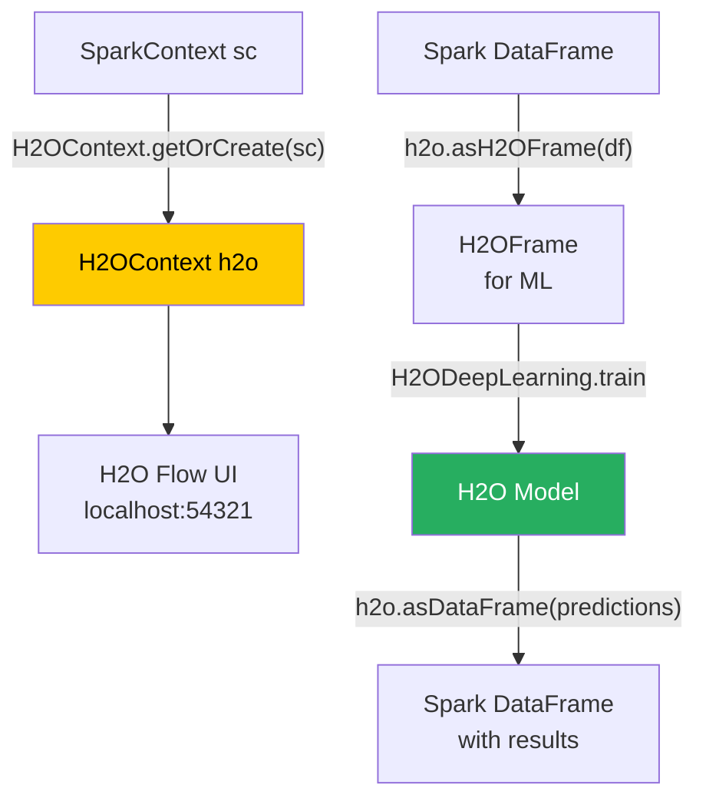

# Sparkling Water API

**Sparkling Water is the integration API that bridges Apache Spark's distributed computing environment with H2O's advanced machine learning engine, enabling seamless interoperability between Spark DataFrames and H2OFrames.**

## Why It Matters

Organizations heavily invested in Apache Spark often find that while Spark excels at ETL, SQL transformations, and structured streaming, its native machine learning library (MLlib) can sometimes lag in cutting-edge algorithms or AutoML capabilities. Conversely, H2O provides a world-class ML engine but relies on external systems to do the heavy lifting of data engineering and preparation. 

The Sparkling Water API matters because it brings the best of both worlds together into a single unified workflow running on a single cluster. It prevents the "data siloing" problem where data engineers process data in a Spark cluster, dump it to a data lake, and then data scientists load it into a completely separate H2O cluster to train models. By providing a clean, programmatic API in Scala, Python (PySparkling), and R (RSparkling), Sparkling Water allows developers to write pipelines that seamlessly transition from Spark SQL data wrangling to H2O deep learning training, and back to Spark for scoring, all within the same application code.

## How It Works

To use Sparkling Water, you must first include the appropriate dependencies in your Spark project (e.g., via Maven or `--packages` in `spark-submit`). The version of Sparkling Water must precisely match the version of Apache Spark you are running. 

The core of the API revolves around the `H2OContext` object. Once a `SparkSession` is created, you initialize the `H2OContext`. Under the hood, this initialization process instructs Spark to launch an H2O node inside every Spark executor JVM currently running. These H2O nodes immediately discover each other over the network and form a distributed, peer-to-peer H2O cluster that shares the physical hardware and memory of the Spark cluster.

The most critical operations in the Sparkling Water API are the bidirectional data conversion methods provided by `H2OContext`:
1.  **`asH2OFrame(sparkDF)`**: This converts a Spark DataFrame (or RDD) into an H2O-optimized `H2OFrame`. Sparkling Water does this intelligently; if the data is already distributed appropriately across the Spark executors, H2O simply creates a lightweight wrapper (an RDD of H2O chunks) that points to the data in memory, minimizing serialization costs and avoiding network shuffles where possible.
2.  **`asDataFrame(h2oFrame)`**: After H2O has finished processing (for example, generating a frame of predictions), this method converts the `H2OFrame` back into a standard Spark DataFrame, allowing the application to continue using standard Spark SQL operations.

Furthermore, Sparkling Water exposes H2O algorithms (like `H2ODeepLearning`, `H2OGBM`, `H2OAutoML`) as standard Spark MLlib `Estimator` objects. This is a profound architectural choice. It means you can insert an H2O Deep Learning model directly into a Spark `Pipeline` alongside Spark's `StringIndexer` or `VectorAssembler`. When you call `pipeline.fit()`, Sparkling Water handles the conversion to H2OFrames internally, trains the H2O model, and returns a Spark `Transformer` (the trained model) that you can use to transform new Spark DataFrames. 

Alongside the programmatic API, initializing the `H2OContext` automatically spins up the **H2O Flow UI**. By navigating to the driver node's IP address on port 54321 (by default), developers get a visual, notebook-like interface. This UI can see the exact same data frames that are registered in the Spark application, allowing data scientists to visually inspect data and tune models while the Spark job is running.

## Flow Diagram



## Data Visualization

The table below outlines the core classes and methods used in the Sparkling Water API across different languages.

| Concept | Scala / Java API | Python API (PySparkling) | Purpose |
|---------|------------------|--------------------------|---------|
| **Context Initialization** | `val hc = H2OContext.getOrCreate()` | `hc = H2OContext.getOrCreate()` | Starts H2O cluster within Spark |
| **Spark to H2O** | `hc.asH2OFrame(df, "frame_name")` | `hc.asH2OFrame(df, "frame_name")` | Converts Spark DF to H2OFrame |
| **H2O to Spark** | `hc.asDataFrame(h2oFrame)` | `hc.asDataFrame(h2oFrame)` | Converts H2OFrame to Spark DF |
| **Spark ML Estimator** | `new H2ODeepLearning()` | `H2ODeepLearning()` | H2O algorithm wrapping for MLlib Pipelines |
| **AutoML Estimator** | `new H2OAutoML()` | `H2OAutoML()` | Runs AutoML returning a Spark PipelineModel |
| **Model Serving** | `new H2OMOJOSettings()` | `H2OMOJOSettings()` | Configure how MOJO models score data |

## Code Example

This complete Scala example demonstrates an end-to-end pipeline: reading data with Spark, training a Deep Learning model with H2O via the Sparkling Water API, and returning predictions to Spark.

```scala
import org.apache.spark.sql.SparkSession
import org.apache.spark.h2o._
import water.support.SparkContextSupport
import org.apache.spark.sql.functions._

// H2O estimators designed to work as Spark MLlib Pipeline stages
import ai.h2o.sparkling.ml.algos.H2ODeepLearning

object SparklingWaterAPIExample {
  def main(args: Array[String]): Unit = {
    // 1. Initialize SparkSession
    val spark = SparkSession.builder()
      .appName("Sparkling Water API Demo")
      .master("local[*]")
      .config("spark.ext.h2o.repl.enabled", "false") // Disable REPL for apps
      .getOrCreate()
      
    // 2. Initialize H2OContext
    // This is the bridge between Spark and H2O
    val hc = H2OContext.getOrCreate()
    println(s"H2O Flow UI is available at: ${hc.flowURL}")
    
    // 3. Data Engineering with Apache Spark
    import spark.implicits._
    // Simulating loading a dataset for binary classification
    val data = Seq(
      (1.2, 3.4, 0.5, "cat"),
      (2.2, 1.4, 4.5, "dog"),
      (1.1, 3.2, 0.6, "cat"),
      (2.5, 1.1, 4.1, "dog"),
      (1.3, 3.5, 0.4, "cat")
    ).toDF("feature1", "feature2", "feature3", "label")

    // Split data into training and testing using Spark
    val Array(trainDF, testDF) = data.randomSplit(Array(0.8, 0.2), seed = 1234L)

    // 4. Configure H2O Deep Learning as a Spark Estimator
    // We do NOT need to manually convert to H2OFrame here; 
    // the H2ODeepLearning estimator handles it internally.
    val estimator = new H2ODeepLearning()
      .setFeaturesCols(Array("feature1", "feature2", "feature3"))
      .setLabelCol("label")
      .setSeed(1L)
      .setHidden(Array(50, 50)) // 2 hidden layers with 50 neurons each
      .setEpochs(10)            // 10 passes over the training data
      .setActivation("RectifierWithDropout") // ReLU with dropout
      .setHiddenDropoutRatios(Array(0.2, 0.2)) // 20% dropout per layer
      
    // 5. Train the model using Spark DataFrame
    // Internally: Spark DF -> H2OFrame -> Train -> Spark PipelineModel
    println("Training H2O Deep Learning model...")
    val model = estimator.fit(trainDF)
    
    // 6. Score the test data
    // Internally: The model scores the Spark DF directly
    println("Scoring test data...")
    val predictionsDF = model.transform(testDF)
    
    // 7. View results using Spark API
    // The resulting DataFrame contains the original columns plus a 'prediction' column
    // and a 'detailed_prediction' struct containing class probabilities
    predictionsDF.select("feature1", "label", "prediction").show()
    
    // Clean up
    hc.stop()
    spark.stop()
  }
}
```

## Common Pitfalls

* **Jar Dependency Conflicts:** Sparkling Water includes heavy dependencies (like specific versions of Jetty, Netty, or Guava) that often conflict with libraries already present in the Spark cluster environment (like Hadoop or Databricks runtimes). Careful shading or dependency exclusion in Maven/SBT is often required.
* **Executor Memory Tuning:** By default, H2O grabs a significant portion of the Spark executor memory. If you configure `spark.executor.memory` to 4GB, Spark and H2O must share this. A common pitfall is OOM (Out of Memory) errors because developers forget that H2O needs room to cache the `H2OFrame` and perform matrix math, starving Spark of execution memory. Tuning `spark.ext.h2o.executor.memory` is critical.
* **Lazy Evaluation Confusion:** Spark is lazily evaluated; H2O is generally eagerly evaluated. When you call `asH2OFrame()`, Sparkling Water forces Spark to compute the lineage of the DataFrame immediately to populate the in-memory H2O store. This can trigger massive unexpected computations if the Spark pipeline prior to conversion is complex.
* **Forgetting to Stop the Context:** In long-running applications or notebooks, repeatedly calling `getOrCreate()` without stopping old contexts can lead to zombie H2O clusters running inside Spark, hoarding resources.
* **String vs Enum:** When moving data from Spark to H2O, Spark StringType columns are mapped to H2O String columns. However, classification algorithms in H2O require categorical data to be typed as "Enum". You often have to explicitly convert the type within the H2OFrame, or let the `H2ODeepLearning` estimator handle it.

## Key Takeaway

Sparkling Water empowers data teams by allowing them to write unified pipelines where Apache Spark handles the heavy-duty data engineering and H2O provides state-of-the-art distributed machine learning, all managed through a seamless, bidirectional API.
