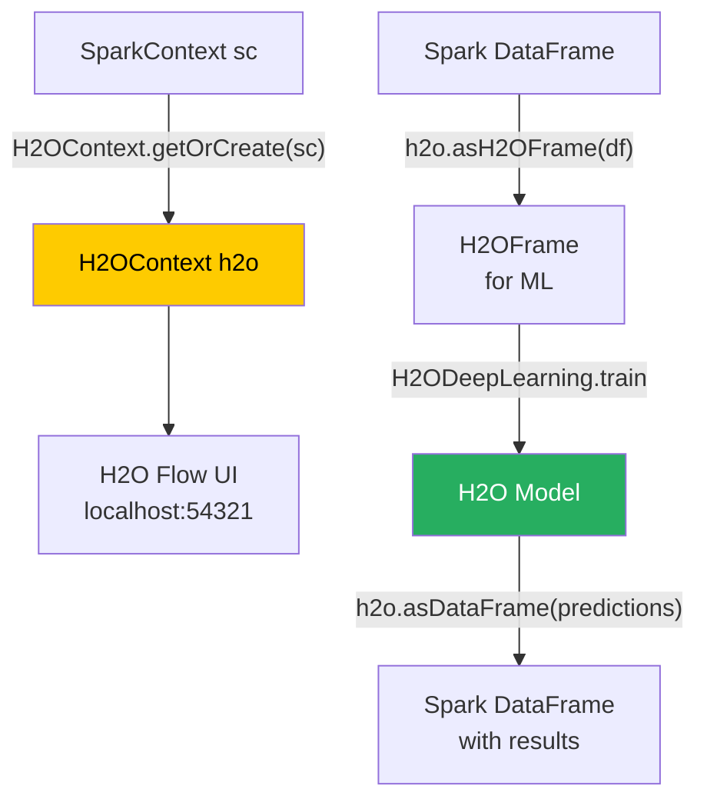

# Sparkling Water API

**Sparkling Water is the integration API that bridges Apache Spark's distributed computing environment with H2O's advanced machine learning engine, enabling seamless interoperability between Spark DataFrames and H2OFrames.**

## Why It Matters

Organizations heavily invested in Apache Spark often find that while Spark excels at ETL, SQL transformations, and structured streaming, its native machine learning library (MLlib) can sometimes lag in cutting-edge algorithms or AutoML capabilities. Conversely, H2O provides a world-class ML engine but relies on external systems to do the heavy lifting of data engineering and preparation. 

The Sparkling Water API matters because it brings the best of both worlds together into a single unified workflow running on a single cluster. It prevents the "data siloing" problem where data engineers process data in a Spark cluster, dump it to a data lake, and then data scientists load it into a completely separate H2O cluster to train models. By providing a clean, programmatic API in Scala, Python (PySparkling), and R (RSparkling), Sparkling Water allows developers to write pipelines that seamlessly transition from Spark SQL data wrangling to H2O deep learning training, and back to Spark for scoring, all within the same application code.

## How It Works

To use Sparkling Water, you must first include the appropriate dependencies in your Spark project (e.g., via Maven or `--packages` in `spark-submit`). The version of Sparkling Water must precisely match the version of Apache Spark you are running. 

The core of the API revolves around the `H2OContext` object. Once a `SparkSession` is created, you initialize the `H2OContext`. Under the hood, this initialization process instructs Spark to launch an H2O node inside every Spark executor JVM currently running. These H2O nodes immediately discover each other over the network and form a distributed, peer-to-peer H2O cluster that shares the physical hardware and memory of the Spark cluster.

The most critical operations in the Sparkling Water API are the bidirectional data conversion methods provided by `H2OContext`:
1.  **`asH2OFrame(sparkDF)`**: This converts a Spark DataFrame (or RDD) into an H2O-optimized `H2OFrame`. Sparkling Water does this intelligently; if the data is already distributed appropriately across the Spark executors, H2O simply creates a lightweight wrapper (an RDD of H2O chunks) that points to the data in memory, minimizing serialization costs and avoiding network shuffles where possible.
2.  **`asDataFrame(h2oFrame)`**: After H2O has finished processing (for example, generating a frame of predictions), this method converts the `H2OFrame` back into a standard Spark DataFrame, allowing the application to continue using standard Spark SQL operations.

Furthermore, Sparkling Water exposes H2O algorithms (like `H2ODeepLearning`, `H2OGBM`, `H2OAutoML`) as standard Spark MLlib `Estimator` objects. This is a profound architectural choice. It means you can insert an H2O Deep Learning model directly into a Spark `Pipeline` alongside Spark's `StringIndexer` or `VectorAssembler`. When you call `pipeline.fit()`, Sparkling Water handles the conversion to H2OFrames internally, trains the H2O model, and returns a Spark `Transformer` (the trained model) that you can use to transform new Spark DataFrames. 

Alongside the programmatic API, initializing the `H2OContext` automatically spins up the **H2O Flow UI**. By navigating to the driver node's IP address on port 54321 (by default), developers get a visual, notebook-like interface. This UI can see the exact same data frames that are registered in the Spark application, allowing data scientists to visually inspect data and tune models while the Spark job is running.

## Flow Diagram



## Data Visualization

The table below outlines the core classes and methods used in the Sparkling Water API across different languages.

| Concept | Scala / Java API | Python API (PySparkling) | Purpose |
|---------|------------------|--------------------------|---------|
| **Context Initialization** | `val hc = H2OContext.getOrCreate()` | `hc = H2OContext.getOrCreate()` | Starts H2O cluster within Spark |
| **Spark to H2O** | `hc.asH2OFrame(df, "frame_name")` | `hc.asH2OFrame(df, "frame_name")` | Converts Spark DF to H2OFrame |
| **H2O to Spark** | `hc.asDataFrame(h2oFrame)` | `hc.asDataFrame(h2oFrame)` | Converts H2OFrame to Spark DF |
| **Spark ML Estimator** | `new H2ODeepLearning()` | `H2ODeepLearning()` | H2O algorithm wrapping for MLlib Pipelines |
| **AutoML Estimator** | `new H2OAutoML()` | `H2OAutoML()` | Runs AutoML returning a Spark PipelineModel |
| **Model Serving** | `new H2OMOJOSettings()` | `H2OMOJOSettings()` | Configure how MOJO models score data |

## Code Example

This complete Scala example demonstrates an end-to-end pipeline: reading data with Spark, training a Deep Learning model with H2O via the Sparkling Water API, and returning predictions to Spark.

```scala
import org.apache.spark.sql.SparkSession
import org.apache.spark.h2o._
import water.support.SparkContextSupport
import org.apache.spark.sql.functions._

// H2O estimators designed to work as Spark MLlib Pipeline stages
import ai.h2o.sparkling.ml.algos.H2ODeepLearning

object SparklingWaterAPIExample {
  def main(args: Array[String]): Unit = {
    // 1. Initialize SparkSession
    val spark = SparkSession.builder()
      .appName("Sparkling Water API Demo")
      .master("local[*]")
      .config("spark.ext.h2o.repl.enabled", "false") // Disable REPL for apps
      .getOrCreate()
      
    // 2. Initialize H2OContext
    // This is the bridge between Spark and H2O
    val hc = H2OContext.getOrCreate()
    println(s"H2O Flow UI is available at: ${hc.flowURL}")
    
    // 3. Data Engineering with Apache Spark
    import spark.implicits._
    // Simulating loading a dataset for binary classification
    val data = Seq(
      (1.2, 3.4, 0.5, "cat"),
      (2.2, 1.4, 4.5, "dog"),
      (1.1, 3.2, 0.6, "cat"),
      (2.5, 1.1, 4.1, "dog"),
      (1.3, 3.5, 0.4, "cat")
    ).toDF("feature1", "feature2", "feature3", "label")

    // Split data into training and testing using Spark
    val Array(trainDF, testDF) = data.randomSplit(Array(0.8, 0.2), seed = 1234L)

    // 4. Configure H2O Deep Learning as a Spark Estimator
    // We do NOT need to manually convert to H2OFrame here; 
    // the H2ODeepLearning estimator handles it internally.
    val estimator = new H2ODeepLearning()
      .setFeaturesCols(Array("feature1", "feature2", "feature3"))
      .setLabelCol("label")
      .setSeed(1L)
      .setHidden(Array(50, 50)) // 2 hidden layers with 50 neurons each
      .setEpochs(10)            // 10 passes over the training data
      .setActivation("RectifierWithDropout") // ReLU with dropout
      .setHiddenDropoutRatios(Array(0.2, 0.2)) // 20% dropout per layer
      
    // 5. Train the model using Spark DataFrame
    // Internally: Spark DF -> H2OFrame -> Train -> Spark PipelineModel
    println("Training H2O Deep Learning model...")
    val model = estimator.fit(trainDF)
    
    // 6. Score the test data
    // Internally: The model scores the Spark DF directly
    println("Scoring test data...")
    val predictionsDF = model.transform(testDF)
    
    // 7. View results using Spark API
    // The resulting DataFrame contains the original columns plus a 'prediction' column
    // and a 'detailed_prediction' struct containing class probabilities
    predictionsDF.select("feature1", "label", "prediction").show()
    
    // Clean up
    hc.stop()
    spark.stop()
  }
}
```

## Common Pitfalls

* **Jar Dependency Conflicts:** Sparkling Water includes heavy dependencies (like specific versions of Jetty, Netty, or Guava) that often conflict with libraries already present in the Spark cluster environment (like Hadoop or Databricks runtimes). Careful shading or dependency exclusion in Maven/SBT is often required.
* **Executor Memory Tuning:** By default, H2O grabs a significant portion of the Spark executor memory. If you configure `spark.executor.memory` to 4GB, Spark and H2O must share this. A common pitfall is OOM (Out of Memory) errors because developers forget that H2O needs room to cache the `H2OFrame` and perform matrix math, starving Spark of execution memory. Tuning `spark.ext.h2o.executor.memory` is critical.
* **Lazy Evaluation Confusion:** Spark is lazily evaluated; H2O is generally eagerly evaluated. When you call `asH2OFrame()`, Sparkling Water forces Spark to compute the lineage of the DataFrame immediately to populate the in-memory H2O store. This can trigger massive unexpected computations if the Spark pipeline prior to conversion is complex.
* **Forgetting to Stop the Context:** In long-running applications or notebooks, repeatedly calling `getOrCreate()` without stopping old contexts can lead to zombie H2O clusters running inside Spark, hoarding resources.
* **String vs Enum:** When moving data from Spark to H2O, Spark StringType columns are mapped to H2O String columns. However, classification algorithms in H2O require categorical data to be typed as "Enum". You often have to explicitly convert the type within the H2OFrame, or let the `H2ODeepLearning` estimator handle it.

## Key Takeaway

Sparkling Water empowers data teams by allowing them to write unified pipelines where Apache Spark handles the heavy-duty data engineering and H2O provides state-of-the-art distributed machine learning, all managed through a seamless, bidirectional API.


---

## 🎓 Deep Learning Questions

### Q1: Why Was This Concept Introduced?
Before Sparkling Water, organizations using Apache Spark for data engineering and H2O for machine learning had to manage two separate clusters. This meant data engineers would process data in Spark, export it to disk or a data lake, and data scientists would then load it into a standalone H2O cluster. This two-step process was slow, prone to I/O bottlenecks, and created "data siloing." Sparkling Water was introduced to eliminate this friction by running H2O directly inside the Spark executors. It overcomes the limitations of slow disk I/O, duplicate cluster management, and disconnected workflows by allowing Spark DataFrames to seamlessly convert to H2OFrames in memory.

### Q2: What Exactly Is This Concept and How Does It Work?
Sparkling Water is an integration API that binds Spark's distributed computing with H2O's machine learning engine. When a Spark application starts and initializes the `H2OContext`, it launches an H2O node inside every Spark executor JVM. These nodes form a peer-to-peer H2O cluster that shares memory and hardware with Spark.
The API provides bidirectional conversion (`asH2OFrame` and `asDataFrame`). Instead of copying data, Sparkling Water creates lightweight wrappers. Furthermore, it wraps H2O algorithms (like `H2ODeepLearning`) as Spark MLlib `Estimator`s, allowing you to embed H2O models natively within standard Spark `Pipeline` objects.

### Q3: Where Should This Concept Be Used?
- **Financial Services**: Fraud detection pipelines where Spark handles real-time streaming transaction ETL, and H2O runs the Deep Learning scoring.
- **Healthcare**: Processing massive sets of unstructured patient logs with Spark, then passing them seamlessly to H2O for advanced predictive modeling on patient outcomes.
- **Retail & E-commerce**: Real-time recommendation engines where Spark handles user clickstream aggregation and H2O AutoML models are used for rapid retraining and scoring.
- **Any Scenario**: Where a company already has a massive investment in Spark infrastructure but needs the advanced machine learning and AutoML capabilities of H2O.

### Q4: Where Should This Concept NOT Be Used?
- **Small Datasets**: If the data fits entirely on a single machine, setting up Spark and Sparkling Water is overkill; open-source Python (Pandas/Scikit-Learn/H2O-3) is much faster.
- **Pure ETL Workloads**: If the pipeline only involves data cleaning and transformations without machine learning, the H2O integration adds unnecessary overhead.
- **When Memory Is Severely Limited**: Running both Spark and H2O in the same JVM requires significant memory tuning. If executor memory is already constrained, sharing it between Spark SQL processing and H2O model training will lead to Out-Of-Memory (OOM) errors.

### Q5: How Is This Concept Different from Hadoop?

| Aspect | Hadoop MapReduce | Apache Spark (with Sparkling Water) |
|---|---|---|
| **Architecture** | Disk-based, batch processing. | In-memory, unified ETL and ML processing. |
| **Performance** | Slower due to intermediate disk writes. | Highly optimized for iterative ML algorithms in memory. |
| **Processing Model** | Strict Map and Reduce phases. | DAG execution with seamless Spark-to-H2O transitions. |
| **Memory Usage** | High disk I/O, low memory dependency. | High memory dependency; Spark and H2O share the executor JVM. |
| **Fault Tolerance** | Replicates data to disk (HDFS). | RDD lineage and H2O in-memory recovery mechanisms. |
| **Scalability** | Massive scale but slow. | Scales horizontally while maintaining high speed. |
| **Ease of Development** | Complex Java code required. | Simple API in Python, Scala, and R (Pipelines/Estimators). |
| **Typical Use Cases** | Log parsing, batch ETL. | Advanced ML, Deep Learning, AutoML, Real-time analytics. |
| **Advantages** | Robust for massive data. | Unified workflow, no data siloing, fast ML. |
| **Disadvantages** | Poor for machine learning. | Complex memory tuning required. |

### Q6: How Can This Concept Be Related to a Traditional RDBMS?

| Traditional RDBMS Concept | Sparkling Water API Equivalent | Explanation |
|---|---|---|
| **SQL Table / View** | Spark DataFrame / `H2OFrame` | The fundamental data structure. `H2OFrame` is just an ML-optimized view of the distributed data. |
| **Stored Procedure** | Spark `Pipeline` | A defined sequence of operations (ETL + H2O ML model training). |
| **CAST / CONVERT** | `asH2OFrame()` / `asDataFrame()` | Transforming data formats from the SQL engine (Spark) to the ML engine (H2O) and back. |
| **Query Optimizer** | Spark Catalyst / H2O Distributed Engine | Optimizes how data is transformed and how ML algorithms compute gradients. |
| **Database Connection** | `H2OContext` | The context object that establishes the link and manages the runtime environment. |

### Q7: What Happens Behind the Scenes?
1. **Context Initialization**: Driver calls `H2OContext.getOrCreate()`.
2. **Cluster Formation**: H2O nodes launch inside Spark executors and discover each other to form a unified cluster.
3. **Data Conversion**: Spark triggers an action, materializes the DataFrame, and `asH2OFrame()` creates H2O chunks pointing to the Spark partitions.
4. **Model Training**: H2O orchestrates MapReduce-like tasks across its nodes to train the Deep Learning model using the H2OFrame.
5. **Prediction**: The trained model generates predictions, and `asDataFrame()` wraps them back into Spark partitions for further SQL processing.

```text
+-------------------+       +-------------------+       +-------------------+
|   Spark Driver    |       |  Spark Executor 1 |       |  Spark Executor 2 |
|                   |       |                   |       |                   |
| H2OContext Init   |------>|  [H2O Node 1]     |<----->|  [H2O Node 2]     |
| Pipeline.fit()    |       |  Spark Partitions |       |  Spark Partitions |
+-------------------+       |  H2O Chunks       |       |  H2O Chunks       |
                            +-------------------+       +-------------------+
```

### Q8: Performance Considerations, Best Practices, and Common Mistakes

| Category | Recommendation | Why It Matters |
|---|---|---|
| **Memory Tuning** | Explicitly configure `spark.ext.h2o.executor.memory`. | Spark and H2O share the same JVM. Without tuning, one will starve the other, causing OOM errors. |
| **Data Lineage** | Persist or cache complex Spark DataFrames before calling `asH2OFrame()`. | `asH2OFrame()` forces an eager evaluation. Complex lineages can cause massive recomputation. |
| **Data Types** | Ensure categorical variables are explicitly cast to Enums in H2O. | H2O algorithms require Enums for classification; Spark Strings are not automatically treated as categorical. |
| **Context Management** | Always call `hc.stop()` at the end of the application. | Prevents zombie H2O clusters from hoarding resources in shared Spark environments. |
| **Cluster Sizing** | Match the number of Spark executors to the expected H2O workload. | H2O relies on peer-to-peer communication. Too many small executors can cause network overhead. |

### Q9: Interview Questions

#### Beginner
1. **What is Sparkling Water?**
   It is an integration API that allows H2O machine learning algorithms to run natively on an Apache Spark cluster.
2. **What is the `H2OContext`?**
   It is the entry point for the API that initializes H2O nodes inside Spark executors and provides methods for data conversion.
3. **How do you convert a Spark DataFrame to an H2OFrame?**
   By using the `hc.asH2OFrame(sparkDF)` method.

#### Intermediate
4. **Why would you use an H2O Estimator inside a Spark Pipeline?**
   It allows you to seamlessly combine Spark's robust feature engineering (like `VectorAssembler`) with H2O's advanced modeling (like `H2ODeepLearning`) into a single, deployable artifact.
5. **How does Sparkling Water handle data transfer between Spark and H2O?**
   It avoids heavy serialization or network shuffles by creating an RDD of H2O chunks that act as lightweight wrappers around the distributed data already in memory.
6. **What is the difference between lazy and eager evaluation in this context?**
   Spark is lazy (waits for an action), while H2O is eager. Converting to an H2OFrame acts as an action and forces Spark to evaluate the DataFrame's lineage.

#### Advanced
7. **Explain the memory architecture of Sparkling Water.**
   Spark and H2O run within the same executor JVM. The `spark.executor.memory` must be carefully split between Spark's execution/storage memory and H2O's memory pool to prevent OOM errors.
8. **How does H2O ensure fault tolerance when running inside Spark?**
   H2O relies heavily on in-memory processing. If a node fails, H2O itself is not as fault-tolerant as Spark; however, the data can be recovered via Spark's RDD lineage, and the H2O job can be restarted.
9. **What causes jar dependency conflicts in Sparkling Water, and how do you resolve them?**
   Sparkling Water bundles dependencies (like Jetty or Guava) that may conflict with the Spark cluster's versions. This is resolved by using shaded jars or carefully excluding dependencies in the build tool.

#### Scenario-Based
10. **Your Sparkling Water application crashes with an Out-Of-Memory error during the `asH2OFrame` conversion. How do you troubleshoot?**
    I would check if the Spark DataFrame's lineage is too complex, causing a massive recomputation. I would `cache()` the Spark DataFrame first. Then, I would review the JVM memory split to ensure H2O has enough allocated memory via `spark.ext.h2o.executor.memory`.
11. **You need to deploy a model built in Sparkling Water to a real-time web application. How do you do it?**
    I would export the trained H2O model as a MOJO (Model Object, Optimized), which is a lightweight Java artifact. The web app can then score new data using the MOJO without needing Spark or H2O installed.

### Q10: Complete Real-World Example

**Business Problem:** A telecom company wants to predict customer churn. They use Spark to process massive call detail records (CDRs) and customer metadata, and want to use H2O's Deep Learning to build the predictive model within the same pipeline.

**Sample Dataset:**
| customer_id | total_calls | total_mins | plan_type | churn (label) |
|---|---|---|---|---|
| 101 | 150 | 500.5 | "premium" | 1 (Yes) |
| 102 | 10 | 45.2 | "basic" | 0 (No) |

**PySparkling Code:**
```python
from pyspark.sql import SparkSession
from pyspark.ml import Pipeline
from pyspark.ml.feature import StringIndexer
from pysparkling import H2OContext
from pysparkling.ml import H2ODeepLearning

# 1. Initialize Spark and H2OContext
spark = SparkSession.builder \
    .appName("Telecom Churn Prediction") \
    .getOrCreate()
hc = H2OContext.getOrCreate()

# 2. Load and Prepare Data (Spark)
data = spark.createDataFrame([
    (101, 150.0, 500.5, "premium", "1"),
    (102, 10.0, 45.2, "basic", "0"),
    (103, 130.0, 480.0, "premium", "1"),
    (104, 20.0, 60.0, "basic", "0")
], ["customer_id", "total_calls", "total_mins", "plan_type", "churn"])

# 3. Feature Engineering (Spark MLlib)
# Convert string plan_type to numeric index
indexer = StringIndexer(inputCol="plan_type", outputCol="plan_indexed")

# 4. Define H2O Deep Learning Estimator
# Integrates seamlessly into the Spark Pipeline
h2o_dl = H2ODeepLearning(
    featuresCols=["total_calls", "total_mins", "plan_indexed"],
    labelCol="churn",
    hidden=[50, 50],
    epochs=20,
    seed=42
)

# 5. Build and Train Pipeline
pipeline = Pipeline(stages=[indexer, h2o_dl])
print("Training Pipeline...")
model = pipeline.fit(data)

# 6. Make Predictions
predictions = model.transform(data)
predictions.select("customer_id", "churn", "prediction").show()

# Clean up
hc.stop()
spark.stop()
```

**Step-by-step execution walkthrough:**
1. Spark initializes and `H2OContext` starts H2O nodes in the executors.
2. Spark creates the DataFrame containing the customer data.
3. The `StringIndexer` transforms the categorical `plan_type` into numeric indices.
4. The `Pipeline.fit()` executes. Spark processes the indexing, then Sparkling Water automatically converts the resulting DataFrame to an `H2OFrame`.
5. H2O trains a 2-layer Deep Learning model across the cluster.
6. The resulting PipelineModel is used to transform the data, generating predictions using H2O's scoring engine.

**Expected output:**
```text
+-----------+-----+----------+
|customer_id|churn|prediction|
+-----------+-----+----------+
|        101|    1|         1|
|        102|    0|         0|
|        103|    1|         1|
|        104|    0|         0|
+-----------+-----+----------+
```

**Performance notes:** The DataFrame should be cached before calling `.fit()` if the upstream ETL processes are expensive, as H2O will force an eager evaluation.

**When this approach is best:** Ideal for large-scale enterprise workflows where data engineers and data scientists want to collaborate on a single unified platform without moving data between disparate systems.

### 💡 Key Takeaways
- Sparkling Water integrates Spark's ETL power with H2O's advanced ML algorithms.
- `H2OContext` forms a peer-to-peer H2O cluster inside the Spark executors.
- Data conversion (`asH2OFrame`) is highly optimized to avoid unnecessary serialization.
- H2O algorithms act as standard Spark MLlib Estimators, enabling unified Pipelines.
- Memory tuning between Spark and H2O is the most critical operational requirement.

### ⚠️ Common Misconceptions
- **Misconception:** Sparkling Water moves data over the network to a separate H2O cluster. **Reality:** H2O runs inside the Spark JVMs; data wrapper pointers are used.
- **Misconception:** You must write H2O-specific code to use it. **Reality:** You can use H2O algorithms just like any other Spark MLlib Estimator via PySparkling/RSparkling.
- **Misconception:** H2O will automatically manage JVM memory for you. **Reality:** You must explicitly configure the memory split to avoid OOM errors.

### 🔗 Related Spark Concepts
- Spark MLlib Pipelines & Estimators
- Resilient Distributed Datasets (RDDs)
- Spark Memory Management and JVM Tuning
- Eager vs. Lazy Evaluation

### 📚 References for Further Reading
- Apache Spark Official Documentation
- H2O.ai Sparkling Water Documentation
- Learning Spark (O'Reilly)
- Spark: The Definitive Guide (O'Reilly)

