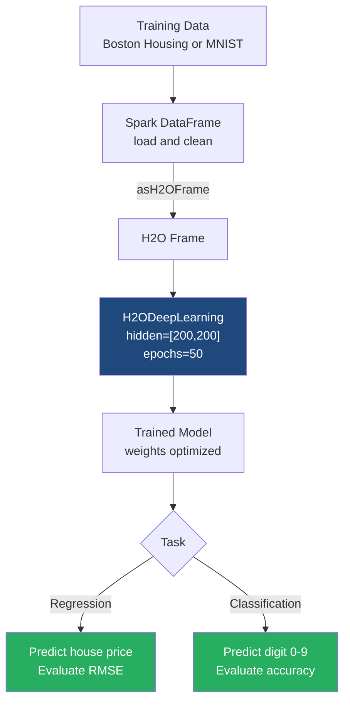

# Regression and Classification with Deep Learning

**Deep Learning models in H2O can seamlessly tackle both continuous value prediction (regression) and complex categorization tasks (classification) by adapting network architecture and loss functions.**

## Why It Matters

In real-world data science, problems generally fall into two broad categories: predicting a continuous number (regression) and predicting a category (classification). For example, predicting the exact sale price of a house is regression, while determining whether a handwritten image represents the digit '0' or '9' is classification. 

It matters because you don't need entirely different frameworks or wildly different algorithms to solve these two distinct problem types. A neural network is a universal function approximator. By simply changing the architecture of the final output layer (e.g., using a linear node for regression vs. multiple Softmax nodes for classification) and changing the optimization metric (Mean Squared Error vs. Cross-Entropy Loss), the exact same underlying deep learning engine can master both tasks. Learning how to configure H2O's Deep Learning estimator for both scenarios equips you with a versatile, high-powered tool capable of replacing dozens of traditional, specialized machine learning models.

## How It Works

**Regression**
When configuring an H2O Deep Learning model for regression (e.g., predicting the continuous value of Boston Housing prices), the target variable column in the `H2OFrame` must be recognized as numeric. H2O automatically detects this and configures the neural network appropriately. The output layer will consist of a single neuron with no non-linear activation function (a linear or identity function). This allows the network to output any real number. During training, the network evaluates its performance using metrics like Mean Squared Error (MSE) or Root Mean Squared Error (RMSE). The network adjusts its weights to minimize the distance between its predicted continuous value and the actual target value.

**Classification (Multi-class)**
When configuring the model for classification (e.g., recognizing handwritten digits like the MNIST dataset), the target variable must be recognized as a categorical (Enum/Factor) type in H2O. If the target column has 10 unique classes (digits 0 through 9), H2O configures the network's output layer to have exactly 10 neurons. It applies a **Softmax** activation function to this final layer. Softmax converts the raw output scores (logits) into a normalized probability distribution, ensuring that all 10 outputs are between 0 and 1, and their sum equals 1.0. 

For example, if the network looks at an image of a '3', the Softmax output for the neuron representing '3' might be 0.85 (85% confident), while the outputs for other neurons are small fractions. The network uses Categorical Cross-Entropy as its loss function, penalizing the model heavily if it assigns a low probability to the correct class.

To ensure success in both cases, hyperparameter tuning is essential. Deep learning models are prone to overfitting, so configuring **dropout ratios** (randomly turning off neurons during training to prevent over-reliance on specific features) and **L1/L2 regularization** (adding penalties to large weights to keep the model simple) are critical steps configured directly in the `H2ODeepLearning` estimator API.

## Flow Diagram



## Data Visualization

### 1. Regression Output Table (House Prices)
Here is how the data transforms. The model attempts to predict the `Target_Price`, outputting `Predicted_Price`.

| Feature_Rooms | Feature_CrimeRate | Feature_Age | Target_Price (Actual) | Predicted_Price (Model) | Error (Residual) |
|---------------|-------------------|-------------|-----------------------|-------------------------|------------------|
| 6.575 | 0.00632 | 65.2 | **24.0** | **23.5** | -0.5 |
| 6.421 | 0.02731 | 78.9 | **21.6** | **22.1** | +0.5 |
| 7.185 | 0.02729 | 61.1 | **34.7** | **31.2** | -3.5 |

### 2. Classification Output Table (Digit Recognition Confusion Matrix)
A confusion matrix is the best way to evaluate multi-class classification. It shows where the model is getting confused.

| Actual \ Predicted | Digit '0' | Digit '1' | Digit '2' | Digit '3' | Error Rate |
|--------------------|-----------|-----------|-----------|-----------|------------|
| **Digit '0'** | **95** | 1 | 2 | 2 | 5.0% |
| **Digit '1'** | 0 | **110** | 1 | 0 | 0.9% |
| **Digit '2'** | 3 | 2 | **88** | 7 | 12.0% |
| **Digit '3'** | 1 | 0 | 4 | **90** | 5.2% |

*(In this example, the model frequently confuses the digit '2' with the digit '3')*

## Code Example

This PySparkling (Python) example demonstrates both a Regression and a Classification task using the H2O estimator API.

```python
from pyspark.sql import SparkSession
from pysparkling import *
from pysparkling.ml import H2ODeepLearning

# Initialize Spark and Sparkling Water
spark = SparkSession.builder.appName("DL_Regression_Classification").getOrCreate()
hc = H2OContext.getOrCreate()

# ==========================================
# PART 1: REGRESSION (Predicting House Prices)
# ==========================================
print("--- Starting Regression Task ---")

# 1. Load dummy housing data (Features + Numeric Target)
housing_data = spark.createDataFrame([
    (6.5, 0.01, 65.0, 24.0),
    (6.4, 0.02, 78.0, 21.6),
    (7.1, 0.02, 61.0, 34.7),
    (5.9, 0.15, 90.0, 18.5)
], ["rooms", "crime_rate", "age", "price"])

# 2. Configure Deep Learning for Regression
dl_regressor = H2ODeepLearning(
    featuresCols=["rooms", "crime_rate", "age"],
    labelCol="price",
    hidden=[200, 200],        # Two wide hidden layers
    epochs=50,                # Training iterations
    activation="Rectifier",   # Standard ReLU
    l1=1e-5,                  # L1 Regularization to drop useless features
    seed=42
)

# 3. Train the model (Spark DataFrame in -> PipelineModel out)
regression_model = dl_regressor.fit(housing_data)

# 4. Predict and evaluate
predictions_reg = regression_model.transform(housing_data)
print("Regression Predictions (Predicting exact price):")
predictions_reg.select("rooms", "price", "prediction").show()


# ==========================================
# PART 2: CLASSIFICATION (Digit Recognition)
# ==========================================
print("--- Starting Classification Task ---")

# 1. Load dummy digit data (Features + Categorical Target)
# Target must be a String type in Spark to be treated as a Category/Enum in H2O
digit_data = spark.createDataFrame([
    (0.0, 0.1, 0.9, "digit_1"),
    (0.8, 0.8, 0.1, "digit_0"),
    (0.1, 0.2, 0.8, "digit_1"),
    (0.9, 0.7, 0.2, "digit_0")
], ["pixel1", "pixel2", "pixel3", "label"])

# 2. Configure Deep Learning for Classification
# Notice the architecture is deeper, and we use dropout for regularization
dl_classifier = H2ODeepLearning(
    featuresCols=["pixel1", "pixel2", "pixel3"],
    labelCol="label",
    hidden=[100, 100, 100],               # Deeper network for complex patterns
    epochs=100,
    activation="RectifierWithDropout",    # ReLU with Dropout enabled
    hiddenDropoutRatios=[0.2, 0.2, 0.2],  # 20% dropout at each layer
    seed=42
)

# 3. Train the classification model
classification_model = dl_classifier.fit(digit_data)

# 4. Predict and evaluate
predictions_cls = classification_model.transform(digit_data)
print("Classification Predictions (Predicting categories with probabilities):")
# The output contains the predicted class AND the detailed probability struct
predictions_cls.select("pixel1", "label", "prediction").show(truncate=False)

# Clean up
hc.stop()
spark.stop()
```

## Common Pitfalls

* **Incorrect Target Data Type:** This is the #1 mistake. If your target column for classification contains integers (e.g., `0, 1, 2` for classes), H2O will assume it is a Regression problem and try to predict a continuous value (like `1.45`). You must explicitly convert the column to a String in Spark or an Enum/Factor in H2O before training so the network knows to use a Softmax output layer.
* **Overfitting with Wide/Deep Networks:** Adding layers and neurons (`hidden=[1024, 1024, 1024]`) increases model capacity. If your dataset is small, the model will simply memorize the training data. Always use `hiddenDropoutRatios` and `l1`/`l2` penalties when increasing network size.
* **Ignoring Early Stopping:** Setting `epochs=1000` without early stopping will waste compute resources and likely cause overfitting. H2O supports early stopping out-of-the-box; always configure `stopping_rounds`, `stopping_metric`, and `stopping_tolerance` to halt training when validation error stops improving.
* **Imbalanced Classes in Classification:** If 99% of your data is "Class A" and 1% is "Class B", the neural network will just learn to always predict "Class A" to achieve 99% accuracy. Use H2O's `balanceClasses=True` parameter to oversample the minority class during training.
* **Unscaled Features:** Neural networks rely on gradient descent. If `rooms` ranges from 1 to 10, but `price` ranges from 100,000 to 1,000,000, the gradients will be vastly distorted. While H2O standardizes features internally by default, failing to verify this when prepping data externally can ruin training.

## Key Takeaway

By simply manipulating the target variable's data type, the H2O deep learning engine seamlessly transitions between predicting continuous numerical values (regression) and categorizing complex data with probability distributions (classification).


---

## 🎓 Deep Learning Questions

### Q1: Why Was This Concept Introduced?
Historically, Spark's native MLlib provided robust machine learning algorithms like Random Forests and Logistic Regression, but lacked native, built-in Deep Learning capabilities. As data grew in complexity (images, text, highly non-linear patterns), basic linear models and tree-based algorithms hit performance ceilings. H2O integrated with Spark (Sparkling Water) was introduced to bridge this gap, allowing data scientists to build complex Multi-Layer Perceptrons (MLPs) directly within Spark pipelines. It overcomes the limitation of having to export Spark DataFrames to external GPU clusters just to train a neural network, unifying big data processing and deep learning.

### Q2: What Exactly Is This Concept and How Does It Work?
Deep Learning in H2O is based on a Multi-Layer Feedforward Artificial Neural Network trained using stochastic gradient descent (SGD) with backpropagation. 
For **Regression**, the network learns to map inputs to a single continuous output using an identity function in the final layer, minimizing Mean Squared Error (MSE). 
For **Classification**, the target variable is categorical. The network uses a Softmax function in the output layer to produce a probability distribution across discrete classes, minimizing Cross-Entropy Loss.
H2O manages the distributed training automatically across the Spark cluster, averaging weights periodically via map-reduce-like operations.

### Q3: Where Should This Concept Be Used?
This concept is highly valuable across various industries:
- **Banking (Classification):** Fraud detection, classifying transactions as legitimate or fraudulent based on thousands of complex features.
- **Retail & E-commerce (Regression):** Predicting customer lifetime value (LTV) or exact sales volumes for inventory forecasting.
- **Healthcare (Classification):** Disease diagnosis based on structured patient history and test results.
- **Uber/Lyft (Regression):** Predicting dynamic pricing multipliers based on real-time weather, traffic, and event data.

### Q4: Where Should This Concept NOT Be Used?
- **Strict Interpretability Requirements:** If regulators require a simple explanation for why a loan was denied, Deep Learning (a "black box") is a poor choice. Use Logistic Regression or Decision Trees.
- **Small Datasets:** Neural networks require massive amounts of data. On small datasets, they easily overfit and perform worse than simple linear models.
- **Simple Linear Relationships:** If the relationship between variables is strictly linear, Deep Learning is overkill and wastes computational resources. 

### Q5: How Is This Concept Different from Hadoop?
| Aspect | Hadoop MapReduce | Apache Spark + H2O Deep Learning |
|--------|------------------|----------------------------------|
| **Architecture** | Disk-based, batch processing. | In-memory, iterative, distributed parameter server. |
| **Performance** | Extremely slow for iterative ML algorithms. | 10x-100x faster due to in-memory caching and optimized C++ backends. |
| **Processing Model** | Rigid Map and Reduce phases. | Highly flexible DAG execution with asynchronous weight updates. |
| **Memory Usage** | Writes intermediate data to disk (HDFS). | Keeps neural network weights and data partitions in RAM. |
| **Fault Tolerance** | Replicates data across nodes. | Recomputes lost partitions via lineage; H2O handles node failures gracefully. |
| **Scalability** | High, but strictly bounded by disk I/O. | High, scales well with cluster memory and CPU cores. |
| **Ease of Development** | Complex, verbose Java code. | Simple Python/Scala API via `H2ODeepLearning` estimator. |
| **Typical Use Cases** | ETL, simple aggregation, log parsing. | High-performance predictive modeling, Neural Networks. |
| **Advantages** | Cheap storage, reliable. | Fast, unified pipeline (data prep + deep learning). |
| **Disadvantages** | Unusable for neural network training. | High memory requirements, complex hyperparameter tuning. |

### Q6: How Can This Concept Be Related to a Traditional RDBMS?
| SQL Concept | Spark/H2O Deep Learning Concept | Explanation |
|-------------|---------------------------------|-------------|
| Table (`SELECT * FROM data`) | DataFrame / H2OFrame | The structured data containing features and targets. |
| `WHERE` clause (Exact Match) | Prediction / Inference | SQL gives exact matches; DL gives probabilistic predictions or estimated values. |
| `GROUP BY` / Aggregation | Feature Engineering | SQL aggregates data; ML uses aggregated data as input features. |
| Stored Procedure | MOJO / PipelineModel | A compiled set of instructions. A MOJO executes the trained model on new data. |
| Primary Key | Target / Label Column | In SQL, a PK identifies a row. In ML, the Label is what you are trying to predict. |

### Q7: What Happens Behind the Scenes?
1. **Driver**: Spark Driver initiates the job and defines the deep learning pipeline.
2. **DataFrame -> H2OFrame**: Spark data is efficiently converted into H2O's compressed columnar format.
3. **Cluster Setup**: H2O spins up a distributed parameter server across the Spark executors.
4. **Forward Pass**: Each executor takes a partition of data, passes it through the network layers, and calculates the error.
5. **Backward Pass (Backprop)**: Executors calculate gradients to update network weights.
6. **Weight Synchronization**: H2O periodically averages the weights from all executors.
7. **Scoring**: The model evaluates its loss on validation data and checks for early stopping.

```text
[Spark Driver] --> [H2O Context]
                       |
        +--------------+--------------+
        |                             |
 [Executor 1 (Partition 1)]    [Executor 2 (Partition 2)]
  - Forward Pass (Loss)         - Forward Pass (Loss)
  - Backpropagation (Gradients) - Backpropagation (Gradients)
        |                             |
        +-------> [Parameter Server] <+
                 (Averages Weights)
```

### Q8: Performance Considerations, Best Practices, and Common Mistakes
| Category | Recommendation | Why It Matters |
|----------|----------------|----------------|
| **Target Type** | Ensure strict typing (String for Classification, Numeric for Regression). | H2O uses the column type to silently decide the network output layer. Mistakes here ruin training. |
| **Epochs & Early Stopping** | Use `stopping_rounds=5` and set `epochs` high. | Prevents overfitting and saves cluster resources by stopping when validation error plateaus. |
| **Architecture** | Start small (e.g., `hidden=[50, 50]`) and scale up. | Giant networks memorize training data and slow down execution unnecessarily. |
| **Regularization** | Use Dropout (`hiddenDropoutRatios`) and L1/L2 penalties. | Forces the network to learn generalized patterns instead of relying on specific, noisy input features. |
| **Class Imbalance** | Set `balanceClasses=True` for classification. | Prevents the model from naively predicting the majority class in fraud or anomaly detection tasks. |

### Q9: Interview Questions
#### Beginner
1. **What dictates whether H2O Deep Learning performs regression or classification?**
   *Answer:* The data type of the target (label) column. Numeric types trigger regression; Categorical (String/Enum) types trigger classification.
2. **What is an epoch in deep learning?**
   *Answer:* One complete pass of the entire training dataset through the neural network.
3. **Why do we use dropout in H2O?**
   *Answer:* To prevent overfitting by randomly disabling a percentage of neurons during training, forcing the network to generalize.

#### Intermediate
4. **How does H2O distribute neural network training across a Spark cluster?**
   *Answer:* It uses a parameter server approach where each node trains on its local data partition, and weights are periodically synchronized and averaged across the cluster.
5. **What loss functions are used for regression vs. classification in H2O?**
   *Answer:* Mean Squared Error (MSE) or Huber loss for regression; Categorical Cross-Entropy for classification.
6. **Why is it critical to scale or standardize input features before deep learning?**
   *Answer:* Unscaled features cause unstable gradients during backpropagation, making the network converge extremely slowly or fail to learn altogether. H2O does this automatically by default.

#### Advanced
7. **Explain how early stopping works in `H2ODeepLearning`.**
   *Answer:* By configuring `stopping_rounds` and `stopping_metric`, the model evaluates validation data after each scoring interval. If the metric doesn't improve by `stopping_tolerance` for the specified rounds, training terminates.
8. **How does H2O handle missing values in deep learning?**
   *Answer:* It performs mean imputation for continuous variables and creates a special missing category for categorical variables automatically during the forward pass.
9. **What is a MOJO, and why is it preferred for production?**
   *Answer:* Model Object, Optimized. It's a highly optimized Java/C++ scoring artifact independent of the H2O runtime, offering microsecond latency for real-time predictions.

#### Scenario-Based
10. **Your binary classification model always predicts "0" and achieves 99% accuracy, but misses all the "1"s. What happened?**
    *Answer:* The dataset is highly imbalanced (e.g., 99% zeros). You must use `balanceClasses=True` or a different metric like AUC-PR instead of accuracy.
11. **Your regression model is massively overfitting despite adding dropout. What can you do?**
    *Answer:* Reduce the number of hidden layers/neurons, increase L1/L2 regularization, or gather more training data.

### Q10: Complete Real-World Example
**Business Problem:** A health insurance company wants to predict whether a medical claim is fraudulent (Classification) and, if so, predict the exact financial impact (Regression). We will focus on the Fraud Classification task.
**Dataset:** Claims data containing patient age, billing codes, hospital type, and a `fraud_reported` flag ("Yes" or "No").

```python
from pyspark.sql import SparkSession
from pysparkling import H2OContext
from pysparkling.ml import H2ODeepLearning

# 1. Initialize Spark & H2O
spark = SparkSession.builder.appName("InsuranceFraudDL").getOrCreate()
hc = H2OContext.getOrCreate()

# 2. Load and Prepare Data
data = [
    (45, "Code_A", "Urban", "No"),
    (62, "Code_B", "Rural", "Yes"),
    (23, "Code_A", "Rural", "No"),
    (50, "Code_C", "Urban", "Yes")
]
columns = ["patient_age", "billing_code", "hospital_type", "fraud_reported"]
claims_df = spark.createDataFrame(data, columns)

# Note: fraud_reported is a String, so H2O will automatically do Classification

# 3. Configure the Deep Learning Estimator
# We use a simple 2-layer network with dropout to prevent overfitting
dl_fraud = H2ODeepLearning(
    featuresCols=["patient_age", "billing_code", "hospital_type"],
    labelCol="fraud_reported",
    hidden=[50, 50],                    # 2 layers of 50 neurons
    epochs=100,                         # Max passes over data
    activation="RectifierWithDropout",  # ReLU + Dropout
    hiddenDropoutRatios=[0.1, 0.1],     # 10% dropout
    stoppingRounds=5,                   # Early stopping
    stoppingMetric="logloss",
    seed=1234
)

# 4. Train the Model
model = dl_fraud.fit(claims_df)

# 5. Make Predictions
predictions = model.transform(claims_df)

# 6. View Results (Shows predicted label and class probabilities)
predictions.select("patient_age", "fraud_reported", "prediction").show()

# Clean up
hc.stop()
spark.stop()
```
**Execution Walkthrough:**
1. Spark creates the DataFrame containing claims.
2. `H2ODeepLearning` initializes. Because `fraud_reported` is a String, it sets up a 2-class Softmax output layer.
3. `fit()` triggers the conversion to H2OFrame and starts distributed training. Dropout is applied randomly.
4. Early stopping monitors `logloss` and halts training if it plateaus.
5. `transform()` predicts fraud on the dataset.
**Expected Output:** A dataframe showing the actual vs. predicted labels, along with raw probabilities for "Yes" and "No".
**Best For:** Complex, non-linear fraud patterns where simple Logistic Regression fails to capture interactions between billing codes and hospital types.

### 💡 Key Takeaways
- H2O unifies Regression and Classification in one Deep Learning estimator.
- Target column data type strictly dictates the network's output layer and loss function.
- Deep Learning excels at complex patterns but requires careful tuning (dropout, regularization) to avoid overfitting.
- Early stopping is critical to save compute resources and ensure generalized models.
- H2O scales model training transparently across the Spark cluster using a parameter server architecture.

### ⚠️ Common Misconceptions
- **Misconception:** You need completely different algorithms for classification vs regression. **Reality:** Only the final output layer and loss function change; the underlying neural network remains identical.
- **Misconception:** More layers always mean better predictions. **Reality:** Too many layers on a simple dataset leads to extreme overfitting.
- **Misconception:** You must handle one-hot encoding for categorical variables manually in H2O. **Reality:** H2O handles categorical encodings internally.

### 🔗 Related Spark Concepts
- PySparkling / Sparkling Water Architecture
- H2O AutoML (Automatic Machine Learning)
- Spark MLlib Pipeline API
- Model Serialization (MOJO/POJO)

### 📚 References for Further Reading
- Apache Spark Official Documentation
- Learning Spark (O'Reilly)
- Spark: The Definitive Guide (O'Reilly)
- H2O.ai Deep Learning Documentation
