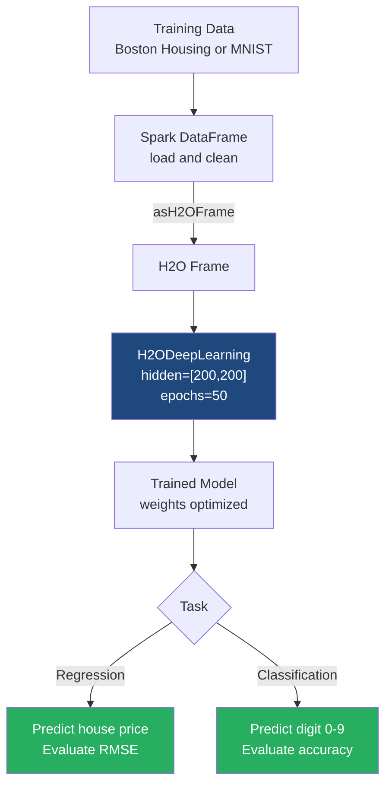

# Regression and Classification with Deep Learning

**Deep Learning models in H2O can seamlessly tackle both continuous value prediction (regression) and complex categorization tasks (classification) by adapting network architecture and loss functions.**

## Why It Matters

In real-world data science, problems generally fall into two broad categories: predicting a continuous number (regression) and predicting a category (classification). For example, predicting the exact sale price of a house is regression, while determining whether a handwritten image represents the digit '0' or '9' is classification. 

It matters because you don't need entirely different frameworks or wildly different algorithms to solve these two distinct problem types. A neural network is a universal function approximator. By simply changing the architecture of the final output layer (e.g., using a linear node for regression vs. multiple Softmax nodes for classification) and changing the optimization metric (Mean Squared Error vs. Cross-Entropy Loss), the exact same underlying deep learning engine can master both tasks. Learning how to configure H2O's Deep Learning estimator for both scenarios equips you with a versatile, high-powered tool capable of replacing dozens of traditional, specialized machine learning models.

## How It Works

**Regression**
When configuring an H2O Deep Learning model for regression (e.g., predicting the continuous value of Boston Housing prices), the target variable column in the `H2OFrame` must be recognized as numeric. H2O automatically detects this and configures the neural network appropriately. The output layer will consist of a single neuron with no non-linear activation function (a linear or identity function). This allows the network to output any real number. During training, the network evaluates its performance using metrics like Mean Squared Error (MSE) or Root Mean Squared Error (RMSE). The network adjusts its weights to minimize the distance between its predicted continuous value and the actual target value.

**Classification (Multi-class)**
When configuring the model for classification (e.g., recognizing handwritten digits like the MNIST dataset), the target variable must be recognized as a categorical (Enum/Factor) type in H2O. If the target column has 10 unique classes (digits 0 through 9), H2O configures the network's output layer to have exactly 10 neurons. It applies a **Softmax** activation function to this final layer. Softmax converts the raw output scores (logits) into a normalized probability distribution, ensuring that all 10 outputs are between 0 and 1, and their sum equals 1.0. 

For example, if the network looks at an image of a '3', the Softmax output for the neuron representing '3' might be 0.85 (85% confident), while the outputs for other neurons are small fractions. The network uses Categorical Cross-Entropy as its loss function, penalizing the model heavily if it assigns a low probability to the correct class.

To ensure success in both cases, hyperparameter tuning is essential. Deep learning models are prone to overfitting, so configuring **dropout ratios** (randomly turning off neurons during training to prevent over-reliance on specific features) and **L1/L2 regularization** (adding penalties to large weights to keep the model simple) are critical steps configured directly in the `H2ODeepLearning` estimator API.

## Flow Diagram



## Data Visualization

### 1. Regression Output Table (House Prices)
Here is how the data transforms. The model attempts to predict the `Target_Price`, outputting `Predicted_Price`.

| Feature_Rooms | Feature_CrimeRate | Feature_Age | Target_Price (Actual) | Predicted_Price (Model) | Error (Residual) |
|---------------|-------------------|-------------|-----------------------|-------------------------|------------------|
| 6.575 | 0.00632 | 65.2 | **24.0** | **23.5** | -0.5 |
| 6.421 | 0.02731 | 78.9 | **21.6** | **22.1** | +0.5 |
| 7.185 | 0.02729 | 61.1 | **34.7** | **31.2** | -3.5 |

### 2. Classification Output Table (Digit Recognition Confusion Matrix)
A confusion matrix is the best way to evaluate multi-class classification. It shows where the model is getting confused.

| Actual \ Predicted | Digit '0' | Digit '1' | Digit '2' | Digit '3' | Error Rate |
|--------------------|-----------|-----------|-----------|-----------|------------|
| **Digit '0'** | **95** | 1 | 2 | 2 | 5.0% |
| **Digit '1'** | 0 | **110** | 1 | 0 | 0.9% |
| **Digit '2'** | 3 | 2 | **88** | 7 | 12.0% |
| **Digit '3'** | 1 | 0 | 4 | **90** | 5.2% |

*(In this example, the model frequently confuses the digit '2' with the digit '3')*

## Code Example

This PySparkling (Python) example demonstrates both a Regression and a Classification task using the H2O estimator API.

```python
from pyspark.sql import SparkSession
from pysparkling import *
from pysparkling.ml import H2ODeepLearning

# Initialize Spark and Sparkling Water
spark = SparkSession.builder.appName("DL_Regression_Classification").getOrCreate()
hc = H2OContext.getOrCreate()

# ==========================================
# PART 1: REGRESSION (Predicting House Prices)
# ==========================================
print("--- Starting Regression Task ---")

# 1. Load dummy housing data (Features + Numeric Target)
housing_data = spark.createDataFrame([
    (6.5, 0.01, 65.0, 24.0),
    (6.4, 0.02, 78.0, 21.6),
    (7.1, 0.02, 61.0, 34.7),
    (5.9, 0.15, 90.0, 18.5)
], ["rooms", "crime_rate", "age", "price"])

# 2. Configure Deep Learning for Regression
dl_regressor = H2ODeepLearning(
    featuresCols=["rooms", "crime_rate", "age"],
    labelCol="price",
    hidden=[200, 200],        # Two wide hidden layers
    epochs=50,                # Training iterations
    activation="Rectifier",   # Standard ReLU
    l1=1e-5,                  # L1 Regularization to drop useless features
    seed=42
)

# 3. Train the model (Spark DataFrame in -> PipelineModel out)
regression_model = dl_regressor.fit(housing_data)

# 4. Predict and evaluate
predictions_reg = regression_model.transform(housing_data)
print("Regression Predictions (Predicting exact price):")
predictions_reg.select("rooms", "price", "prediction").show()


# ==========================================
# PART 2: CLASSIFICATION (Digit Recognition)
# ==========================================
print("--- Starting Classification Task ---")

# 1. Load dummy digit data (Features + Categorical Target)
# Target must be a String type in Spark to be treated as a Category/Enum in H2O
digit_data = spark.createDataFrame([
    (0.0, 0.1, 0.9, "digit_1"),
    (0.8, 0.8, 0.1, "digit_0"),
    (0.1, 0.2, 0.8, "digit_1"),
    (0.9, 0.7, 0.2, "digit_0")
], ["pixel1", "pixel2", "pixel3", "label"])

# 2. Configure Deep Learning for Classification
# Notice the architecture is deeper, and we use dropout for regularization
dl_classifier = H2ODeepLearning(
    featuresCols=["pixel1", "pixel2", "pixel3"],
    labelCol="label",
    hidden=[100, 100, 100],               # Deeper network for complex patterns
    epochs=100,
    activation="RectifierWithDropout",    # ReLU with Dropout enabled
    hiddenDropoutRatios=[0.2, 0.2, 0.2],  # 20% dropout at each layer
    seed=42
)

# 3. Train the classification model
classification_model = dl_classifier.fit(digit_data)

# 4. Predict and evaluate
predictions_cls = classification_model.transform(digit_data)
print("Classification Predictions (Predicting categories with probabilities):")
# The output contains the predicted class AND the detailed probability struct
predictions_cls.select("pixel1", "label", "prediction").show(truncate=False)

# Clean up
hc.stop()
spark.stop()
```

## Common Pitfalls

* **Incorrect Target Data Type:** This is the #1 mistake. If your target column for classification contains integers (e.g., `0, 1, 2` for classes), H2O will assume it is a Regression problem and try to predict a continuous value (like `1.45`). You must explicitly convert the column to a String in Spark or an Enum/Factor in H2O before training so the network knows to use a Softmax output layer.
* **Overfitting with Wide/Deep Networks:** Adding layers and neurons (`hidden=[1024, 1024, 1024]`) increases model capacity. If your dataset is small, the model will simply memorize the training data. Always use `hiddenDropoutRatios` and `l1`/`l2` penalties when increasing network size.
* **Ignoring Early Stopping:** Setting `epochs=1000` without early stopping will waste compute resources and likely cause overfitting. H2O supports early stopping out-of-the-box; always configure `stopping_rounds`, `stopping_metric`, and `stopping_tolerance` to halt training when validation error stops improving.
* **Imbalanced Classes in Classification:** If 99% of your data is "Class A" and 1% is "Class B", the neural network will just learn to always predict "Class A" to achieve 99% accuracy. Use H2O's `balanceClasses=True` parameter to oversample the minority class during training.
* **Unscaled Features:** Neural networks rely on gradient descent. If `rooms` ranges from 1 to 10, but `price` ranges from 100,000 to 1,000,000, the gradients will be vastly distorted. While H2O standardizes features internally by default, failing to verify this when prepping data externally can ruin training.

## Key Takeaway

By simply manipulating the target variable's data type, the H2O deep learning engine seamlessly transitions between predicting continuous numerical values (regression) and categorizing complex data with probability distributions (classification).
