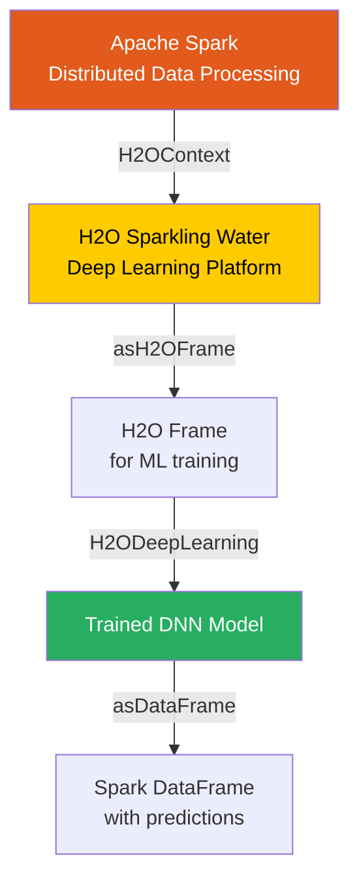

# Chapter 14: Deep Learning on Spark with H2O Overview

**A comprehensive guide bridging the gap between distributed Apache Spark data processing and the powerful deep learning capabilities of H2O.ai via Sparkling Water.**

## Why It Matters

In modern data engineering and machine learning workflows, Apache Spark has become the de facto standard for distributed data processing, ETL (Extract, Transform, Load), and feature engineering. However, when it comes to advanced machine learning algorithms—specifically deep neural networks—Spark's native MLlib can sometimes fall short in terms of advanced model architectures, AutoML capabilities, and raw computational efficiency for complex non-linear models. 

This is where H2O.ai steps in. H2O is a leading open-source, in-memory, distributed machine learning and predictive analytics platform. By combining the data wrangling power of Spark with the deep learning and advanced modeling power of H2O, data scientists and engineers can build robust, end-to-end machine learning pipelines. Sparkling Water is the integration layer that allows these two massive ecosystems to communicate seamlessly. It matters because it eliminates the need to export data out of Spark into a separate deep learning cluster; instead, you can train state-of-the-art neural networks right alongside your Spark data pipelines, maintaining a single unified cluster, saving significant time, avoiding data movement bottlenecks, and simplifying deployment architectures.

## How It Works

Sparkling Water effectively fuses the execution environments of Apache Spark and H2O. It operates by launching H2O nodes alongside Spark executors within the same JVMs. This co-location means that data can be shared and transferred between Spark's memory space and H2O's memory space with minimal serialization overhead. 

At the core of this integration is the `H2OContext`. Much like how `SparkContext` or `SparkSession` is the entry point for Spark applications, `H2OContext` is the entry point for H2O operations within a Spark application. When a Spark application initializes an `H2OContext`, Sparkling Water starts an H2O cluster distributed across the Spark executor nodes. This creates a unified environment where Spark DataFrames (or RDDs) can be effortlessly converted into `H2OFrame` objects, and vice versa. 

The conversion process is designed to be highly efficient. When you call `asH2OFrame()` on a Spark DataFrame, Sparkling Water does not typically need to shuffle or serialize the entire dataset over the network if the data is already distributed correctly. Instead, it utilizes shared memory spaces or efficient local memory copies to expose the data to the H2O algorithms. Once the data is represented as an `H2OFrame`, you can utilize H2O's robust suite of algorithms—including Distributed Random Forests, Gradient Boosting Machines, Generalized Linear Models, and highly scalable Deep Learning models. 

Furthermore, Sparkling Water allows you to use H2O algorithms directly within Spark MLlib pipelines as standard Spark `Estimator` and `Transformer` objects. This means you can train a deep learning model using H2O, yet seamlessly integrate it into a Spark `Pipeline` alongside standard Spark feature transformers (like `StringIndexer` or `VectorAssembler`). After the model is trained, predictions can be converted back into a Spark DataFrame using `asDataFrame()`, allowing you to continue processing, aggregating, or writing the results using standard Spark APIs.

## Flow Diagram



## Data Visualization

The following table illustrates the seamless conceptual transformation of data as it moves from Spark into H2O, through a deep learning model, and back to Spark.

| Step | Data Structure | Location / Engine | Action / Transformation | Schema Representation |
|------|----------------|-------------------|--------------------------|-----------------------|
| 1 | Spark DataFrame | Spark JVM | Read raw data (Parquet) | `[age: int, income: double, label: int]` |
| 2 | Spark DataFrame | Spark JVM | Handle missing values | `[age: int, income: double, label: int]` |
| 3 | H2OFrame | H2O JVM (co-located) | `hc.asH2OFrame(df)` | `[age: numeric, income: numeric, label: enum]` |
| 4 | H2O Deep Learning Model | H2O Distributed Compute | Train on H2OFrame | `H2OModel` object |
| 5 | H2OFrame | H2O JVM | Predict on test data | `[predict: enum, p0: double, p1: double]` |
| 6 | Spark DataFrame | Spark JVM | `hc.asDataFrame(preds)` | `[predict: string, p0: double, p1: double]` |

## Code Example

```scala
// A simplified Scala example demonstrating the integration between Spark and H2O
import org.apache.spark.sql.SparkSession
import org.apache.spark.h2o._
import water.support.SparkContextSupport

object Chapter14Overview {
  def main(args: Array[String]): Unit = {
    // 1. Initialize SparkSession
    val spark = SparkSession.builder()
      .appName("Sparkling Water Overview")
      .master("local[*]")
      .getOrCreate()
      
    // 2. Initialize H2OContext using the SparkSession
    // This starts the H2O cluster inside the Spark executors
    val hc = H2OContext.getOrCreate()
    
    println(hc.toString()) // Prints details about the H2O cluster
    
    import spark.implicits._
    
    // 3. Create a dummy Spark DataFrame
    val sparkDF = Seq(
      (25, 50000.0, 1),
      (35, 75000.0, 0),
      (45, 120000.0, 1),
      (22, 30000.0, 0)
    ).toDF("age", "income", "churn")
    
    // 4. Convert Spark DataFrame to H2OFrame
    // Notice the seamless transition using the H2OContext
    val h2oFrame = hc.asH2OFrame(sparkDF, "customer_data")
    
    // Convert 'churn' to categorical (enum in H2O terminology) for classification
    h2oFrame.replace(2, h2oFrame.vec("churn").toCategoricalVec)
    
    // Display H2OFrame summary (similar to df.describe() in Spark)
    println(h2oFrame.summary())
    
    // 5. Convert H2OFrame back to Spark DataFrame
    val convertedDF = hc.asDataFrame(h2oFrame)
    convertedDF.show()
    
    // Clean up resources
    hc.stop()
    spark.stop()
  }
}
```

## Common Pitfalls

* **Version Mismatch:** The most common issue with Sparkling Water is version incompatibility between Apache Spark and the Sparkling Water package. Each Sparkling Water release is tied to a very specific minor version of Spark (e.g., Spark 3.1 requires a different Sparkling Water build than Spark 3.2).
* **Memory Management:** Because Spark and H2O are running within the same JVM, they share the same memory space. If you do not allocate enough executor memory, or fail to tune memory fractions appropriately, you will quickly run into `OutOfMemoryError` exceptions during heavy model training.
* **Leaking H2OFrames:** H2O explicitly manages memory for its frames. Unlike Spark DataFrames which are garbage collected naturally, you often need to explicitly call `.delete()` or `.remove()` on H2OFrames when you are done with them to free up the distributed key-value store.
* **Context Initialization:** Attempting to use H2O algorithms before `H2OContext.getOrCreate()` has been called will result in silent failures or initialization errors. Always ensure the context is active.
* **Serialization Overheads:** While conversion between Spark and H2O is optimized, repeatedly converting large datasets back and forth within a highly iterative loop can introduce unnecessary serialization overhead. Convert once, train/predict, and convert back.

## Key Takeaway

Sparkling Water elegantly marries Apache Spark's distributed data engineering dominance with H2O's cutting-edge distributed deep learning capabilities, providing a unified, scalable ecosystem for modern machine learning workflows.
