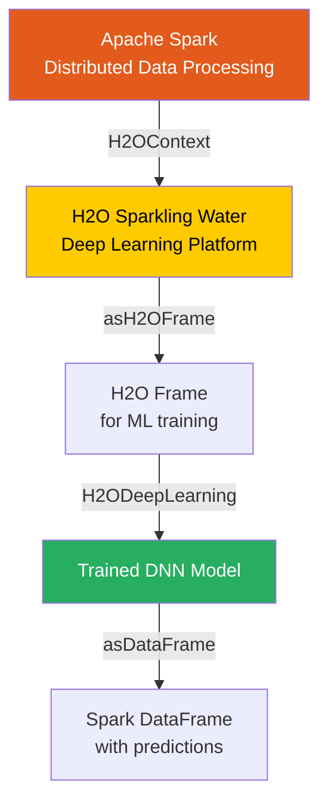

# Chapter 14: Deep Learning on Spark with H2O Overview

**A comprehensive guide bridging the gap between distributed Apache Spark data processing and the powerful deep learning capabilities of H2O.ai via Sparkling Water.**

## Why It Matters

In modern data engineering and machine learning workflows, Apache Spark has become the de facto standard for distributed data processing, ETL (Extract, Transform, Load), and feature engineering. However, when it comes to advanced machine learning algorithms—specifically deep neural networks—Spark's native MLlib can sometimes fall short in terms of advanced model architectures, AutoML capabilities, and raw computational efficiency for complex non-linear models. 

This is where H2O.ai steps in. H2O is a leading open-source, in-memory, distributed machine learning and predictive analytics platform. By combining the data wrangling power of Spark with the deep learning and advanced modeling power of H2O, data scientists and engineers can build robust, end-to-end machine learning pipelines. Sparkling Water is the integration layer that allows these two massive ecosystems to communicate seamlessly. It matters because it eliminates the need to export data out of Spark into a separate deep learning cluster; instead, you can train state-of-the-art neural networks right alongside your Spark data pipelines, maintaining a single unified cluster, saving significant time, avoiding data movement bottlenecks, and simplifying deployment architectures.

## How It Works

Sparkling Water effectively fuses the execution environments of Apache Spark and H2O. It operates by launching H2O nodes alongside Spark executors within the same JVMs. This co-location means that data can be shared and transferred between Spark's memory space and H2O's memory space with minimal serialization overhead. 

At the core of this integration is the `H2OContext`. Much like how `SparkContext` or `SparkSession` is the entry point for Spark applications, `H2OContext` is the entry point for H2O operations within a Spark application. When a Spark application initializes an `H2OContext`, Sparkling Water starts an H2O cluster distributed across the Spark executor nodes. This creates a unified environment where Spark DataFrames (or RDDs) can be effortlessly converted into `H2OFrame` objects, and vice versa. 

The conversion process is designed to be highly efficient. When you call `asH2OFrame()` on a Spark DataFrame, Sparkling Water does not typically need to shuffle or serialize the entire dataset over the network if the data is already distributed correctly. Instead, it utilizes shared memory spaces or efficient local memory copies to expose the data to the H2O algorithms. Once the data is represented as an `H2OFrame`, you can utilize H2O's robust suite of algorithms—including Distributed Random Forests, Gradient Boosting Machines, Generalized Linear Models, and highly scalable Deep Learning models. 

Furthermore, Sparkling Water allows you to use H2O algorithms directly within Spark MLlib pipelines as standard Spark `Estimator` and `Transformer` objects. This means you can train a deep learning model using H2O, yet seamlessly integrate it into a Spark `Pipeline` alongside standard Spark feature transformers (like `StringIndexer` or `VectorAssembler`). After the model is trained, predictions can be converted back into a Spark DataFrame using `asDataFrame()`, allowing you to continue processing, aggregating, or writing the results using standard Spark APIs.

## Flow Diagram



## Data Visualization

The following table illustrates the seamless conceptual transformation of data as it moves from Spark into H2O, through a deep learning model, and back to Spark.

| Step | Data Structure | Location / Engine | Action / Transformation | Schema Representation |
|------|----------------|-------------------|--------------------------|-----------------------|
| 1 | Spark DataFrame | Spark JVM | Read raw data (Parquet) | `[age: int, income: double, label: int]` |
| 2 | Spark DataFrame | Spark JVM | Handle missing values | `[age: int, income: double, label: int]` |
| 3 | H2OFrame | H2O JVM (co-located) | `hc.asH2OFrame(df)` | `[age: numeric, income: numeric, label: enum]` |
| 4 | H2O Deep Learning Model | H2O Distributed Compute | Train on H2OFrame | `H2OModel` object |
| 5 | H2OFrame | H2O JVM | Predict on test data | `[predict: enum, p0: double, p1: double]` |
| 6 | Spark DataFrame | Spark JVM | `hc.asDataFrame(preds)` | `[predict: string, p0: double, p1: double]` |

## Code Example

```scala
// A simplified Scala example demonstrating the integration between Spark and H2O
import org.apache.spark.sql.SparkSession
import org.apache.spark.h2o._
import water.support.SparkContextSupport

object Chapter14Overview {
  def main(args: Array[String]): Unit = {
    // 1. Initialize SparkSession
    val spark = SparkSession.builder()
      .appName("Sparkling Water Overview")
      .master("local[*]")
      .getOrCreate()
      
    // 2. Initialize H2OContext using the SparkSession
    // This starts the H2O cluster inside the Spark executors
    val hc = H2OContext.getOrCreate()
    
    println(hc.toString()) // Prints details about the H2O cluster
    
    import spark.implicits._
    
    // 3. Create a dummy Spark DataFrame
    val sparkDF = Seq(
      (25, 50000.0, 1),
      (35, 75000.0, 0),
      (45, 120000.0, 1),
      (22, 30000.0, 0)
    ).toDF("age", "income", "churn")
    
    // 4. Convert Spark DataFrame to H2OFrame
    // Notice the seamless transition using the H2OContext
    val h2oFrame = hc.asH2OFrame(sparkDF, "customer_data")
    
    // Convert 'churn' to categorical (enum in H2O terminology) for classification
    h2oFrame.replace(2, h2oFrame.vec("churn").toCategoricalVec)
    
    // Display H2OFrame summary (similar to df.describe() in Spark)
    println(h2oFrame.summary())
    
    // 5. Convert H2OFrame back to Spark DataFrame
    val convertedDF = hc.asDataFrame(h2oFrame)
    convertedDF.show()
    
    // Clean up resources
    hc.stop()
    spark.stop()
  }
}
```

## Common Pitfalls

* **Version Mismatch:** The most common issue with Sparkling Water is version incompatibility between Apache Spark and the Sparkling Water package. Each Sparkling Water release is tied to a very specific minor version of Spark (e.g., Spark 3.1 requires a different Sparkling Water build than Spark 3.2).
* **Memory Management:** Because Spark and H2O are running within the same JVM, they share the same memory space. If you do not allocate enough executor memory, or fail to tune memory fractions appropriately, you will quickly run into `OutOfMemoryError` exceptions during heavy model training.
* **Leaking H2OFrames:** H2O explicitly manages memory for its frames. Unlike Spark DataFrames which are garbage collected naturally, you often need to explicitly call `.delete()` or `.remove()` on H2OFrames when you are done with them to free up the distributed key-value store.
* **Context Initialization:** Attempting to use H2O algorithms before `H2OContext.getOrCreate()` has been called will result in silent failures or initialization errors. Always ensure the context is active.
* **Serialization Overheads:** While conversion between Spark and H2O is optimized, repeatedly converting large datasets back and forth within a highly iterative loop can introduce unnecessary serialization overhead. Convert once, train/predict, and convert back.

## Key Takeaway

Sparkling Water elegantly marries Apache Spark's distributed data engineering dominance with H2O's cutting-edge distributed deep learning capabilities, providing a unified, scalable ecosystem for modern machine learning workflows.


---

## 🎓 Deep Learning Questions

### Q1: Why Was This Concept Introduced?
Before the advent of **Sparkling Water** (the integration between H2O and Apache Spark), building end-to-end deep learning pipelines was highly fragmented. Data engineers would use Spark to process massive datasets, perform ETL, and engineer features. However, Spark's native MLlib had limited support for advanced Deep Learning architectures and lacked robust AutoML functionality.
Consequently, data science teams were forced to export their pre-processed data out of the Spark cluster into a separate deep learning framework (like a standalone H2O cluster, TensorFlow, or PyTorch). 
This paradigm created major limitations:
*   **Data Movement Bottlenecks:** Moving terabytes of data over the network from a Spark cluster to a Deep Learning cluster was incredibly slow and costly.
*   **Architectural Complexity:** Managing two separate distributed clusters (one for ETL, one for ML) required massive overhead and DevOps effort.
*   **Deployment Friction:** Stitching together a pipeline that spans multiple disconnected tools made productionalizing models difficult.

**Sparkling Water** was introduced to solve this by marrying the two. It allows H2O's advanced deep learning algorithms to run directly on the *same* Spark cluster, within the *same* JVM memory space, eliminating data movement and unifying the entire workflow into one seamless pipeline.

### Q2: What Exactly Is This Concept and How Does It Work?
**Sparkling Water** is an integration layer that allows you to use H2O's machine learning engine directly within Apache Spark. It works by launching H2O instances side-by-side with Spark Executors. 

When you initialize an `H2OContext` in your Spark application, Sparkling Water spawns an H2O node inside every Spark Executor JVM. Because both engines are running in the exact same Java Virtual Machine on the worker nodes, they can share memory.

Here is the execution flow:
1.  **Data Processing:** You use Spark's powerful DataFrame API to clean, aggregate, and prepare your data.
2.  **Zero-Copy Transition:** When you call `asH2OFrame()`, Sparkling Water translates the Spark DataFrame into an `H2OFrame`. Thanks to shared memory, this happens rapidly without shuffling massive amounts of data over the network.
3.  **Deep Learning:** You trigger H2O's deep learning algorithms (Multi-layer Perceptrons, Ensembles, or AutoML). H2O uses its highly optimized distributed math engine to train the neural network across the cluster.
4.  **Prediction and Return:** The predictions are generated in H2O, converted back into a Spark DataFrame using `asDataFrame()`, and written back to disk or a database using Spark.

### Q3: Where Should This Concept Be Used?
Deep learning via Sparkling Water shines in scenarios involving massive, complex datasets where traditional ML algorithms (like Linear Regression or basic Random Forests) fail to capture intricate, non-linear relationships.

**Real-World Production Scenarios:**
*   **Financial Services (Fraud Detection):** Detecting credit card fraud requires analyzing thousands of transactional features simultaneously. Deep learning models can map complex sequential patterns in spending behavior much better than traditional ML.
*   **Healthcare (Patient Risk Prediction):** Analyzing electronic health records (EHR) containing dense, heterogeneous data (lab results, demographics, text notes) to predict readmission risks.
*   **Retail & E-Commerce (Personalized Recommendations):** Netflix and Amazon use deep neural networks to build complex user embeddings and item embeddings to predict what a user will watch or buy next, based on billions of historical interactions.
*   **AdTech (Click-Through Rate Prediction):** Predicting CTR for programmatic advertising requires processing massive sparse datasets in real-time, which H2O's distributed deep learning handles efficiently.

### Q4: Where Should This Concept NOT Be Used?
Deep learning on Spark via H2O is not a silver bullet. There are many anti-patterns where this architecture is overkill or sub-optimal.

*   **Small Datasets:** If your data fits in the memory of a single laptop (e.g., < 10 GB), spinning up a distributed Spark + H2O cluster is severely inefficient. Local libraries like Scikit-Learn or PyTorch will be much faster.
*   **Tabular Data with Simple Linear Relationships:** If a basic Logistic Regression or Gradient Boosted Tree (XGBoost) can solve the problem with 95% accuracy, applying a complex Deep Neural Network will simply waste compute resources and reduce interpretability.
*   **Heavy Image/Video Processing (Computer Vision):** While H2O supports deep learning, it is primarily optimized for distributed tabular data. For heavy GPU-accelerated tasks like training Convolutional Neural Networks (CNNs) on raw images, dedicated frameworks like PyTorch or TensorFlow on GPU clusters are superior to Sparkling Water on standard Spark nodes.
*   **Strict Interpretability Requirements:** If regulators require a highly explainable model (e.g., loan approval algorithms), Deep Learning models are often "black boxes" compared to decision trees or generalized linear models.

### Q5: How Is This Concept Different from Hadoop?

| Aspect | Hadoop MapReduce (Mahout) | Apache Spark + H2O (Sparkling Water) |
| :--- | :--- | :--- |
| **Architecture** | Disk-bound batch processing (Map -> Write -> Reduce) | In-memory distributed processing (Shared JVM) |
| **Performance** | Extremely slow for iterative ML algorithms | Up to 100x faster due to caching and in-memory execution |
| **Processing Model** | Strict Map and Reduce phases | Direct Acyclic Graphs (DAGs) and optimized H2O multi-threading |
| **Memory Usage** | Reads/Writes to HDFS between every job step | Data resides in RAM; seamless DataFrame to H2OFrame sharing |
| **Algorithm Support** | Basic traditional ML (Mahout on Hadoop) | State-of-the-art Deep Learning, AutoML, GBMs, Ensembles |
| **Ease of Development** | Verbose Java boilerplate | High-level APIs in Python, R, Scala, and SQL |
| **Use Case** | Legacy batch aggregations and counting | Modern end-to-end data pipelines and Predictive AI |

### Q6: How Can This Concept Be Related to a Traditional RDBMS?
For SQL developers, transitioning to distributed Deep Learning might seem daunting. Here is a conceptual mapping:

| Traditional RDBMS (SQL) | Spark + H2O (Deep Learning) | Explanation |
| :--- | :--- | :--- |
| **Database Table / View** | **Spark DataFrame** | The foundational tabular data structure containing your features. |
| **ETL Stored Procedures** | **Spark Transformations** | The steps you take to clean data before training (`filter`, `groupBy`). |
| **Materialized View** | **H2OFrame** | The optimized data structure passed to the ML engine for processing. |
| **Analytical Function (e.g. Linear Reg)** | **Deep Learning Estimator** | The actual math engine that finds patterns in the data. |
| **SQL `INSERT INTO ... SELECT`** | **Model `predict()` & `asDataFrame()`** | Taking the model's predictions and appending them back to the data. |

Think of H2O as a highly advanced, ultra-fast analytical plugin that sits directly on top of your database (Spark), eliminating the need to export your tables to an external tool.

### Q7: What Happens Behind the Scenes?
When you trigger an H2O Deep Learning job within Spark, a highly orchestrated process occurs:

1.  **Spark Driver** initializes the `SparkSession` and then the `H2OContext`.
2.  The **H2OContext** broadcasts a signal to launch an H2O node inside every Spark Executor JVM.
3.  You execute Spark DataFrame transformations (DAG execution).
4.  You call `asH2OFrame()`. Data pointers are shared in-memory. H2O compresses the data into its proprietary column-compressed format.
5.  **H2O Deep Learning** initiates. It uses a distributed approach called *Hogwild!* (lock-free asynchronous stochastic gradient descent).
6.  Each H2O node computes gradients on its local chunk of data.
7.  Nodes periodically synchronize their neural network weights across the cluster via fast peer-to-peer TCP communication (bypassing Spark's shuffle).
8.  The final Trained Model is assembled on the leader node.

```text
+-------------------+       +-------------------+       +-------------------+
|   Spark Driver    |       |  Spark Executor   |       |  Spark Executor   |
| (H2OContext Init) | ----> |   + H2O Node 1    | <---> |   + H2O Node 2    |
+-------------------+       | (JVM Shared Mem)  | P2P   | (JVM Shared Mem)  |
                            |  [Hogwild! SGD]   | Sync  |  [Hogwild! SGD]   |
                            +-------------------+       +-------------------+
```

### Q8: Performance Considerations, Best Practices, and Common Mistakes

| Category | Recommendation | Why It Matters |
| :--- | :--- | :--- |
| **Memory Allocation** | Give Executors plenty of RAM (`--executor-memory`). | Spark and H2O share the same JVM. If Spark caches too much data, H2O will crash with OutOfMemory errors during deep learning backpropagation. |
| **Data Types** | Cast String labels to Enums (Categoricals) explicitly. | H2O Deep Learning will perform Regression if the target is a numeric or string, but requires a categorical type to perform Classification. |
| **Garbage Collection** | Explicitly call `h2oFrame.delete()`. | Unlike Spark, H2O does not automatically garbage collect frames in its Key-Value store. Memory leaks will occur if you don't clean up manually. |
| **Cluster Sizing** | Use fewer, "fatter" nodes rather than many small nodes. | Deep Learning requires heavy network synchronization (weight updates). Fewer nodes with more cores reduce network chatter and speed up training. |
| **Data Imbalance** | Use `balance_classes = True` in H2O config. | Deep neural networks are highly sensitive to imbalanced datasets (e.g., 99% non-fraud, 1% fraud), leading to biased predictions. |

### Q9: Interview Questions

#### Beginner
1.  **What is the purpose of Sparkling Water?**
    *   It integrates H2O's machine learning engine directly with Apache Spark, allowing data pipelines and model training to occur in the same cluster and memory space.
2.  **How do you convert a Spark DataFrame to an H2OFrame?**
    *   By initializing an `H2OContext` (often abbreviated as `hc`) and using the `hc.asH2OFrame(sparkDF)` method.
3.  **Why would you use H2O Deep Learning instead of Spark MLlib's Multi-Layer Perceptron?**
    *   H2O offers a significantly more advanced, optimized, and scalable deep learning engine with features like AutoML, adaptive learning rates, dropout, and better hyperparameter tuning.

#### Intermediate
1.  **Explain the memory relationship between Spark and H2O in Sparkling Water.**
    *   They operate within the exact same Java Virtual Machine (JVM) on worker nodes. This co-location allows them to share data efficiently without massive serialization overhead.
2.  **What is the *Hogwild!* algorithm used by H2O Deep Learning?**
    *   It is a lock-free approach to parallel Stochastic Gradient Descent (SGD). Multiple threads update the neural network weights concurrently without locking the memory, which drastically speeds up training with a minimal penalty to accuracy.
3.  **How do you prevent `OutOfMemory` (OOM) errors in Sparkling Water?**
    *   You must tune the Spark Executor memory, ensure you aren't persisting unnecessary Spark DataFrames, and manually delete `H2OFrames` from H2O's distributed key-value store using `.remove()` or `.delete()` once they are no longer needed.

#### Advanced
1.  **How does Sparkling Water handle the difference between Spark's lazy evaluation and H2O's eager execution?**
    *   When you call `asH2OFrame()`, Sparkling Water forces Spark to evaluate its DAG, materialize the RDDs/DataFrames, and eagerly load the data into H2O's memory structure. This boundary acts as an action in the Spark execution plan.
2.  **Can you include an H2O Deep Learning model inside a standard Spark ML `Pipeline`?**
    *   Yes, Sparkling Water provides `H2OPipeline` wrappers (like `H2ODeepLearningEstimator`) that conform to the Spark ML `Estimator` API. This allows you to chain Spark transformers and H2O models in a single pipeline object.
3.  **Describe how network communication differs during Spark ETL vs H2O Model Training.**
    *   Spark relies on a MapReduce-style shuffle (writing intermediate data to disk and fetching it via HTTP). H2O nodes use a custom, high-speed peer-to-peer TCP network layer to rapidly synchronize gradient updates across the cluster, completely bypassing Spark's network protocols during the training phase.

#### Scenario-Based
1.  **You trained a Deep Learning model on H2O, but the predictions are returning continuous probabilities instead of "Yes/No" classes. What went wrong?**
    *   You forgot to cast your target/label column to an `enum` (categorical) type before training. H2O saw a numeric target (e.g., 1 or 0) and assumed you wanted to perform Regression, not Binary Classification.
2.  **Your Spark+H2O cluster runs perfectly on a 10 GB dataset, but hangs indefinitely during training on a 500 GB dataset. What should you investigate?**
    *   Investigate network saturation and garbage collection (GC) pauses. For 500 GB, gradient synchronization across nodes can saturate the network. Additionally, heavy GC pauses in the JVM can cause H2O nodes to miss heartbeats, leading the cluster to assume node failure and hang.

### Q10: Complete Real-World Example
**Business Problem:** A telecom company (e.g., AT&T or Verizon) wants to predict Customer Churn. They have terabytes of customer demographic and usage data processed in Spark, but want to use a Deep Neural Network to capture complex nonlinear usage patterns and flag high-risk customers for retention campaigns.

**Dataset Description:** A tabular dataset with features like `tenure`, `monthly_charges`, `total_data_gb`, and a `churn` label (1 for churned, 0 for retained).

**PySpark & H2O Code Implementation:**
```python
from pyspark.sql import SparkSession
from pyspark.sql.functions import col
from pysparkling import *
import h2o
from h2o.estimators.deeplearning import H2ODeepLearningEstimator

# 1. Initialize Spark and H2O Context
spark = SparkSession.builder \
    .appName("Telecom_Churn_DeepLearning") \
    .config("spark.ext.h2o.repl.enabled", "false") \
    .getOrCreate()

hc = H2OContext.getOrCreate()
print(hc)

# 2. Load and Preprocess Data via Spark
# Assume we load a massive parquet file from distributed storage
df = spark.read.parquet("hdfs://data/telecom_churn.parquet")

# Simple ETL: fill nulls
df_clean = df.fillna({"monthly_charges": 0.0, "total_data_gb": 0.0})

# 3. Convert Spark DataFrame to H2OFrame (Zero-copy transition)
h2o_df = hc.asH2OFrame(df_clean, "churn_data")

# 4. Mandatory: Convert the target variable to Categorical for Classification
h2o_df["churn"] = h2o_df["churn"].asfactor()

# 5. Split Data into Train and Test in H2O
train, test = h2o_df.split_frame(ratios=[0.8], seed=42)

# 6. Define the Deep Learning Estimator
# Architecture: 3 hidden layers with 64 neurons each, using Rectifier activation
dl_model = H2ODeepLearningEstimator(
    hidden=[64, 64, 64],
    epochs=20,
    activation="RectifierWithDropout",
    input_dropout_ratio=0.2, # Prevent overfitting
    balance_classes=True,    # Handle imbalanced churn data
    seed=1234
)

# 7. Train the Model
x_cols = ["tenure", "monthly_charges", "total_data_gb"]
y_col = "churn"
dl_model.train(x=x_cols, y=y_col, training_frame=train, validation_frame=test)

# 8. Evaluate Model Performance
print(dl_model.model_performance(test_data=test))

# 9. Make Predictions and Convert Back to Spark
predictions_h2o = dl_model.predict(test)
predictions_spark = hc.asDataFrame(predictions_h2o)

# 10. Display predictions alongside original identifiers (using Spark)
predictions_spark.show(5)

# Cleanup Memory
h2o.remove_all()
spark.stop()
```

### 💡 Key Takeaways
- Sparkling Water seamlessly integrates the data processing power of Spark with the advanced machine learning algorithms of H2O.
- Spark and H2O run inside the same JVM, sharing memory space and avoiding network data transfers during the DataFrame-to-H2OFrame conversion.
- H2O's Deep Learning uses Hogwild! SGD, enabling fast, distributed, lock-free model training.
- Always cast binary/categorical target variables to enums (factors) before training to avoid accidental regression.
- Manual garbage collection of H2OFrames is essential to prevent OutOfMemory errors.

### ⚠️ Common Misconceptions
- "Sparkling Water is just a Python library." False. It is a deeply integrated JVM architecture that launches H2O nodes alongside Spark executors.
- "You need to export data to disk to use H2O." False. The integration is in-memory and heavily bypasses disk I/O.
- "H2O is best for computer vision deep learning." False. While it has deep neural networks, it is primarily optimized for massive tabular data; PyTorch/TensorFlow are better for images/text.
- "Spark MLlib has the exact same deep learning capabilities." False. Spark MLlib has a very basic Multilayer Perceptron; H2O has much richer architectures, early stopping, and AutoML.

### 🔗 Related Spark Concepts
- Spark MLlib (Pipelines, Estimators, Transformers)
- Spark Memory Management (JVM, Garbage Collection, Tungsten)
- Distributed Architecture (Driver, Executors, Cores)
- PySpark Pandas API (Koalas)

### 📚 References for Further Reading
- Apache Spark Official Documentation
- H2O.ai Sparkling Water Documentation
- Learning Spark (O'Reilly)
- Spark: The Definitive Guide (O'Reilly)
