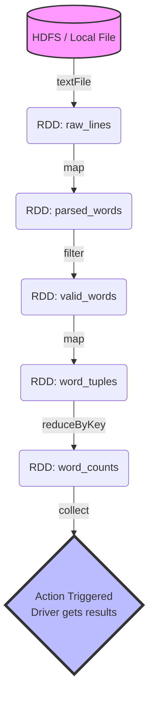
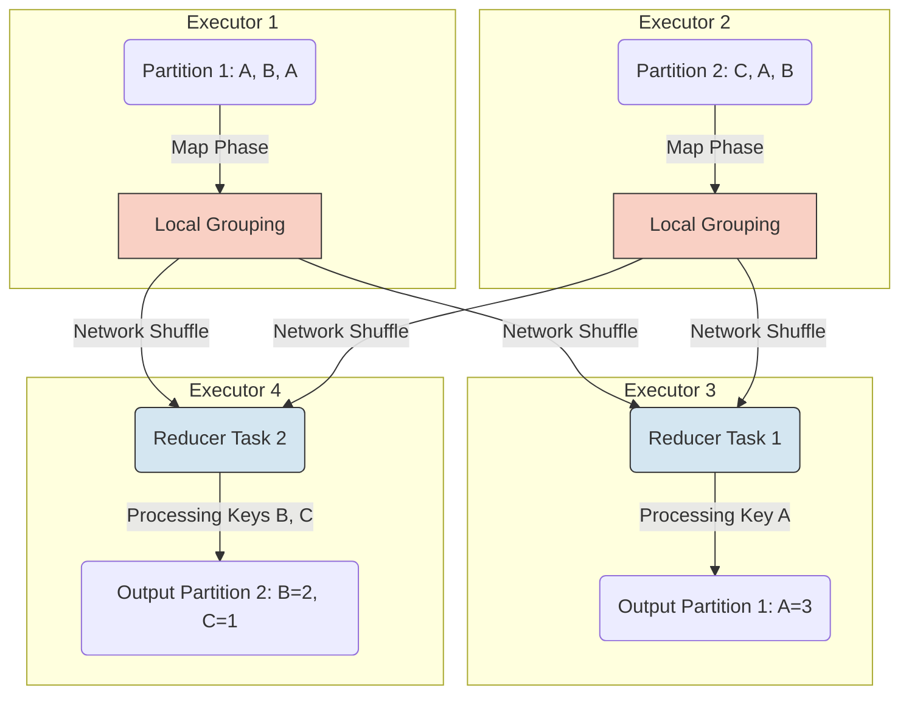
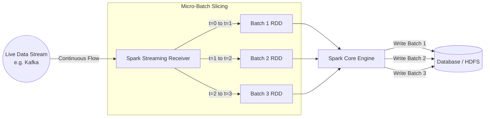

# Spark in Action: Detailed Concepts Study Guide v2.0

Welcome to v2.0 of the study guide. This version dives much deeper into the core mechanics of Apache Spark, providing code examples, data visualizations, and architectural flow diagrams to help you thoroughly understand the inner workings of Spark components.

---

## 1. Resilient Distributed Datasets (RDDs) & Lineage

### The Concept
An RDD is the foundational data structure of Spark. It is an immutable, partitioned collection of records that can be operated on in parallel. Because they are immutable, Spark achieves fault tolerance through a mechanism called **lineage**—keeping a graph of transformations that produced the RDD, rather than replicating the data.

### Flow Diagram: RDD Lineage (DAG)
When you apply *transformations* (like `map` or `filter`), Spark doesn't compute them immediately. It builds a Directed Acyclic Graph (DAG) of the operations. Computation only starts when an *action* (like `collect` or `count`) is called.



### Code Example & Data Visualization
Imagine we have a log file and we want to count occurrences of the word "ERROR".

```scala
// 1. Creation (Transformation - Lazy)
val lines = sc.textFile("server.log")

// 2. Transformation (Lazy)
val errors = lines.filter(line => line.contains("ERROR"))

// 3. Transformation (Lazy)
val errorTuples = errors.map(line => ("ERROR", 1))

// 4. Transformation (Lazy - requires shuffle)
val errorCounts = errorTuples.reduceByKey((a, b) => a + b)

// 5. Action (Eager - Triggers DAG execution)
val result = errorCounts.collect()
```

---

## 2. Data Partitioning and Shuffling

### The Concept
To process data in parallel, Spark divides the data into **partitions**. Each partition is processed by a single task on a single CPU core. 
*   **Narrow Dependencies:** Operations where each partition of the parent RDD is used by at most one partition of the child RDD (e.g., `map`, `filter`). These are fast.
*   **Wide Dependencies (Shuffles):** Operations where multiple child partitions may depend on a single parent partition (e.g., `reduceByKey`, `join`). This requires moving data across the network between executors, which is highly expensive.

### Flow Diagram: The Shuffle Process



### Data Visualization: Before and After Shuffle
*Operation:* `reduceByKey` on a list of words.

| Executor Node | Input Partition Data | --> | Network Shuffle | --> | Executor Node | Output Partition Data |
| :--- | :--- | :--- | :--- | :--- | :--- | :--- |
| **Node 1** | `("apple", 1), ("banana", 1), ("apple", 1)` | | Sends "banana" to Node 2 | | **Node 1** | `("apple", 3)` |
| **Node 2** | `("orange", 1), ("apple", 1), ("banana", 1)` | | Sends "apple" to Node 1 | | **Node 2** | `("banana", 2), ("orange", 1)` |

---

## 3. Spark SQL and the Catalyst Optimizer

### The Concept
Spark SQL uses **DataFrames** (datasets organized into named columns). Because Spark knows the schema of the data, it can use the **Catalyst Optimizer** to deeply optimize your code before it runs.

### Flow Diagram: Catalyst Optimizer
Catalyst transforms your high-level SQL/DataFrame code into highly optimized low-level Java bytecode.

```mermaid
graph LR
    A[SQL Query / DataFrame API] --> B[Unresolved Logical Plan]
    B -->|Catalog / Schema Analysis| C[Resolved Logical Plan]
    C -->|Logical Optimization <br> e.g., Filter Pushdown| D[Optimized Logical Plan]
    D -->|Physical Planning| E[Multiple Physical Plans]
    E -->|Cost Model Evaluation| F[Selected Physical Plan]
    F -->|Code Generation <br> Tungsten| G[Executable RDDs]
    
    style C fill:#d5f5e3
    style D fill:#a9cce3
    style F fill:#7fb3d5
    style G fill:#2471a3,color:#fff
```



### Code Example: Filter Pushdown
*Filter Pushdown* means Spark applies filters at the database or storage level (e.g., inside the Parquet file) *before* loading the data into memory.

```scala
// Unoptimized thinking: Load entire 1TB dataset, then filter.
// Catalyst Reality: Catalyst realizes we only need "age > 30". It tells the Parquet reader to only read rows where age > 30.
val df = spark.read.parquet("users.parquet")
val adults = df.filter($"age" > 30).select("name", "age")
adults.show()
```

---

## 4. Spark Streaming (Micro-Batch Architecture)

### The Concept
Spark Streaming ingests continuous data (like Kafka topics) and divides it into discrete, small chunks called **micro-batches** (or DStreams). Each micro-batch is essentially a standard RDD processed by the Spark Core engine.

### Flow Diagram: Micro-Batching



### Data Visualization: Sliding Window Operations
In streaming, you often want to calculate metrics over a "sliding window" (e.g., top trending words in the last 60 seconds, updated every 10 seconds).
*   **Window Length:** How far back in time the window covers (e.g., 30 seconds).
*   **Sliding Interval:** How often the window calculates new results (e.g., 10 seconds).

| Time (seconds) | Incoming Micro-Batch Data | Window State (Window=30s, Slide=10s) | Output Result |
| :--- | :--- | :--- | :--- |
| `t = 10` | `[A, B, C]` | `[Batch_10]` | Count: 3 |
| `t = 20` | `[D, E]` | `[Batch_10, Batch_20]` | Count: 5 |
| `t = 30` | `[F, G, H]` | `[Batch_10, Batch_20, Batch_30]` | Count: 8 |
| `t = 40` | `[I]` | `[Batch_20, Batch_30, Batch_40]` *(Batch_10 dropped)* | Count: 6 |

---

## 5. Machine Learning Pipelines (Spark MLlib)

### The Concept
Machine learning involves messy workflows: parsing strings to numbers, filling missing values, scaling features, and finally training the model. Spark ML uses **Pipelines** to string these steps together so they can be easily executed and cross-validated.

### Flow Diagram: ML Pipeline
```mermaid
graph LR
    A[(Raw DataFrame)] -->|Transformer| B[StringIndexer]
    B -->|Transformer| C[OneHotEncoder]
    C -->|Transformer| D[VectorAssembler]
    D -->|Estimator| E[LogisticRegression Algorithm]
    
    E -->|fit()| F((Trained ML Model))
    
    G[(Test DataFrame)] -->|transform()| F
    F --> H[Predictions DataFrame]
```

### Code Example: Building the Pipeline
```scala
import org.apache.spark.ml.Pipeline
import org.apache.spark.ml.feature.{StringIndexer, VectorAssembler}
import org.apache.spark.ml.classification.LogisticRegression

// 1. Define stages
val indexer = new StringIndexer().setInputCol("gender").setOutputCol("genderIndex")
val assembler = new VectorAssembler().setInputCols(Array("age", "genderIndex")).setOutputCol("features")
val lr = new LogisticRegression().setMaxIter(10).setRegParam(0.01)

// 2. Chain stages into a Pipeline
val pipeline = new Pipeline().setStages(Array(indexer, assembler, lr))

// 3. Train the model (executes all stages in order)
val model = pipeline.fit(trainingData)

// 4. Make predictions on new data
val predictions = model.transform(testData)
```
